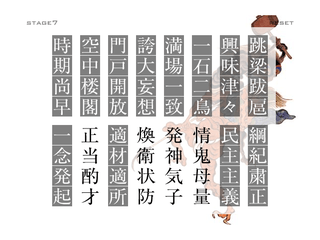
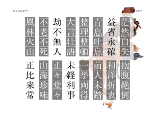
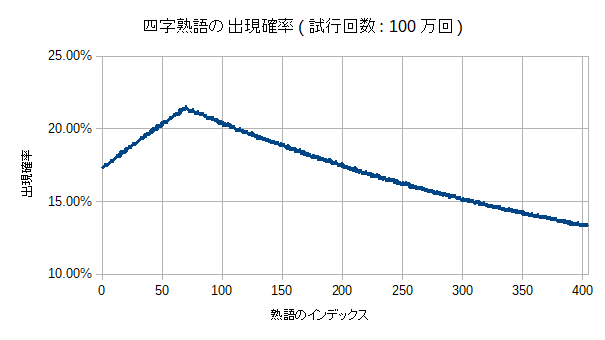
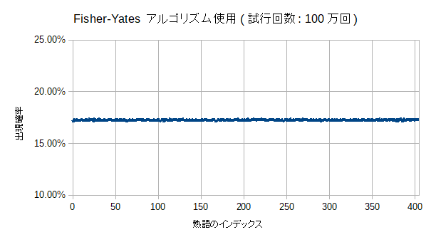
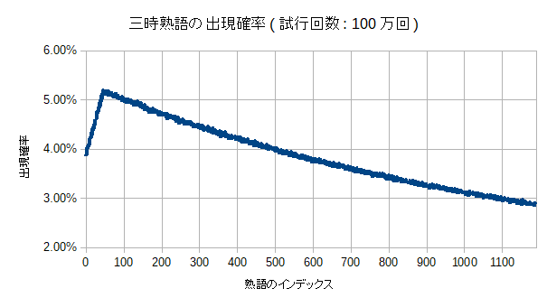

<!-- TOC depthFrom:1 depthTo:2 -->

- [四字熟語Flash RTA攻略](#四字熟語flash-rta攻略)
  - [どんなゲーム？](#どんなゲーム)
  - [RTAの歴史](#rtaの歴史)
  - [基本戦略](#基本戦略)
  - [小ネタ](#小ネタ)
  - [見つけやすい熟語](#見つけやすい熟語)
  - [ニ字以上共通している熟語](#ニ字以上共通している熟語)
  - [紛らわしい漢字](#紛らわしい漢字)

<!-- /TOC -->

# 四字熟語Flash RTA攻略

[旧ページ](http://pingval.g1.xrea.com/etc/4ji-strategy.html)

----

## どんなゲーム？

- ランダムに配置された漢字をマウスで入れ替えて四字熟語を作るFlashゲー。使用されている熟語は405種類、漢字は719種類。どうやら2004年末辺りから存在しているらしい。
- 漢字をクリックしたときや熟語を揃えたときの効果音の中毒性、そして感動のエンディングに定評がある。
- 用意された熟語を全て揃えるとSTAGEクリア。最初のSTAGE 1で揃える熟語は4個だけだが、最後のSTAGE 7ではその4倍の16個もの熟語を揃える必要がある。

| STAGE | 熟語の数 |
| :---: | :---: |
| 1 | 4 |
| 2 | 6 |
| 3 | 8 |
| 4 | 10 |
| 5 | 12 |
| 6 | 14 |
| 7 | 16 |
| 合計 | 70 |

- RTAの計測区間は、「タイトル画面右下隅のGAME STARTボタンをクリックした瞬間」から「STAGE 7クリア後の じょーん という効果音が鳴った瞬間」まで。
- Flash不使用の[スマホ対応版](https://www.gamedesign.jp/sp/yoji/)も存在するが操作性が異なる上、4面までしかない。
- こんなゲームのRTAとか冗談に思われるかもしれないが、なかなかどうして、やりこむと奥が深いのです。

----

## RTAの歴史
- PeerCastという配信コミュニティで2010~2012年に流行り、記録集では100人以上の記録が登録されている(参考: [Peercast Record/四字熟語 - Peca視聴者Wiki](https://peca.nemusg.com/index.php?cmd=read&page=Peercast%20Record%2F%BB%CD%BB%FA%BD%CF%B8%EC))。
- SRCにも[Leaderboard](https://www.speedrun.com/Yojijukugo_Flash)がある。私がModeratorです。
- 最速記録は[Arel.氏の3:40](https://www.youtube.com/watch?v=rgydJa7T6hU)。比較的最近のプレイヤーだが唯一の3分台記録保持者であり、2位に30秒以上もの大差を付けている。
- [くまのプーさんのホームランダービー](https://kids.yahoo.co.jp/games/sports/013.html)などのFlashゲー同様、2020年末のFlashサポート終了に伴う競技終了が危惧されていると専らの噂である。しかし[Adobe Flash Player projector](https://www.adobe.com/support/flashplayer/debug_downloads.html)を使えばスタンドアローンでyojijuku.swfを再生できるのでサポートが切れても安心！(たぶん)
<!-- - 2019年11月現在、4分台はその中でも6人しかいない。そして、その中で一番遅い4:59という記録を持っているのが自分(ping値)。 -->

## 基本戦略
### 熟語と「一確」の漢字を暗記する
「春」に対する「小春日和」や「森」に対する「森羅万象」のような、「この漢字はこの熟語でしか使用されていない」という「一確」の漢字を覚えておく。そういった熟語をメインに揃えていけば、必要な漢字が見つからない状況はかなり防げる。

### マウス操作は速度より精度を重視する
基本的に、「マウスで熟語を揃えること」と「周辺視野で漢字を把握すること」を同時に行う。そのため、マウス操作はどちらかというと速度より精度が求められる。

### 画面が上下に別れるSTAGE 4辺りからは、端から熟語を揃える
なるべく上下や左右から熟語を確定させることによって、終盤の視点移動やマウス移動を減らす。

| good | bad |
| :---: | :---: |
|  |  |

----

## 小ネタ
### 「一確」の中でも、見つけやすい漢字で構成される熟語を優先して揃える
「秋」に対する「一日千秋］、「孫」に対する「子々孫々」、「九」に対する「十中八九」など。こういった熟語があればラッキー。

### 一度登場した熟語はクリアまで出現しない仕様(「一攫千金」を除く)を利用する
例えば「折」は「和洋折衷」と「紆余曲折」でのみ使われている。だから「和洋折衷」が揃った場合、次に「折」を見つけたら「紆余曲折」確定と判断できる、など。  
例外として、データが二重登録されている「一攫千金」のみクリアまでに2回登場する可能性がある。

### 「無」を積極的に探す
「無」は2番目に出現頻度の高い漢字。出現頻度の高い他の「一」や「不」ほど目につきやすい形ではないが、探せばだいたいすぐ見つかるため、必要なら積極的に探してよい。

### 確実に複数ある漢字の探索を優先する
「足」(「自給自足」が確定)に対する「自」、「脱」(「誤字脱字」が確定)に対する「字」、「以」(「以心伝心」が確定)に対する心など。

### 状況再現(非実用的)
以下の手順に従うと、状況再現のようなことができる。
1. STAGE 7まで進み、全て揃える前に右上のRESETボタンを押す。
2. 「STAGE 1でRESETボタンを押す」を84回繰り返す。
3. 次のプレイの熟語の出現パターンは最初にSTAGE 7まで進んだときのものと同じ。

ただし、
- 漢字の並びはバラバラ
- いいパターンを引くには試行回数を重ねるしかない
- 打開まで行ってしまうと同じパターンは二度と引けない

という実用性に欠けるもの。

#### 原理
ゲームをロードする時、406個の熟語の配列が([アルゴリズムに多少問題があるものの](#熟語の出現率の偏り))シャッフルされ、それが先頭から消費されてゆく。このため熟語の出現パターンはゲームをロードするたびに変化する。しかしゲームのプレイ中に右上のRESETボタンを押せば、ゲームをリロードすることなくタイトル画面へ戻れる。これは「熟語の配列の並びを保持したままリスタートできる」ことを意味する。  
STAGE 1~7で消費される熟語は70個、STAGE 1は4個なので、「STAGE 7まで進んでRESETボタン → STAGE 1で84回RESETボタン」とすると、配列の要素数と同じ`70 + 4 * 84 = 406`個の熟語が消費されることになる。そしてこの状態でスタートすれば熟語が再び配列の最初から消費されるため、最初にSTAGE 7まで進んだときの熟語の出現パターンが再現される。  
漢字の並びはSTAGE開始時にシャッフルされるため制御できない。大願成就するとRESETボタンが消えるのでそのプレイのパターンは二度と再現できなくなる。

「RESETボタンを押す前に出現した熟語はリロードしない限りしばらくは出てこない」ということでもある。リスタートするときにRESETボタンを使うとなんとなく状況再現の一端を利用した感じがするので自分はFlash自体をリロードしている。

### 熟語の出現率の偏り
このゲームは熟語をランダムに取り出すのに「熟語406個(405と「一攫千金」の二重入力で+1)の配列をシャッフル→先頭から順番に取り出す」という手順を踏んでいる。一様分布なら出現率は全て`(4+6+8+10+12+14+16)/406=約17.24%`になるが、シャッフルアルゴリズムに問題があるようで、実際の出現率には偏りがある。最大は「頑固一徹」の21.44%、最小は「避難訓練」の13.26%で、約1.6倍の開きがある。  
実際のプレイでは「竜」の「画竜点睛」(21.31%)と「竜頭蛇尾」(13.66%)くらい出現率に差があれば気にすべきかもしれない。
<!-- 出現率STAGEごとでも異なるはずだがそこまでカバーするのはめんどいな -->


- [四字熟語の出現率一覧](./4ji-dist.txt)
- [四字熟語の出現率一覧(出現率で降順)](./4ji-dist-sorted.txt)

```
// flareで抽出した当該コード
    i = 0;
    while (i < jukugo_max) {
      r = Math.floor(Math.random() * jukugo_max);
      tmp = this['jukugo' + i];
      this['jukugo' + i] = this['jukugo' + r];
      this['jukugo' + r] = tmp;
      ++i;
    }
```
<!--

```
// Fisher-Yates アルゴリズム
    i = jukugo_max - 1;
    while (i > 0) {
      r = Math.floor(Math.random() * (i + 1));
      tmp = this['jukugo' + i];
      this['jukugo' + i] = this['jukugo' + r];
      this['jukugo' + r] = tmp;
      --i;
    }
```
-->

漢字の配置並び替えでも同じシャッフルアルゴリズムが使われているが、ややこしいのでそっちは気にしないことにする。なお、三時熟語Flashでも同様の偏りがある。


- [三時熟語の出現率一覧](./3ji-dist.txt)
- [三時熟語の出現率一覧(出現率で降順)](./3ji-dist-sorted.txt)

----

## 見つけやすい熟語

個人差ありあり。

| 熟語 | 確定の漢字 |
| :---: | :---: |
| 一期一会 | 会 |
| 一朝一夕 | 夕 |
| 一日千秋 | 秋 |
| 津々浦々 | 浦 |
| 子々孫々 | 孫 |
| 三々五々 | |
| 五臓六腑 | 臓or腑 |
| 五分五分 | |
| 七転八倒<br>七転八起 | 七 |
| 十中八九 | 九 |
| 十人十色 | |
| 四方八方 | |
| 四苦八苦 | |
| 四六時中 | |
| 正々堂々<br>威風堂々 | 堂 |
| 二束三文 |
| 二人三脚 | 脚 |
| 二転三転 | |
| 魑魅魍魎 | 全て |
| 一筆啓上 | 筆or啓 |
| 以心伝心 | 以 |
| 開口一番 | 番 |
| 国士無双 | 双 |
| 自縄自縛 | 縄or縛 |
| 波乱万丈 | 丈 |

----

## ニ字以上共通している熟語

取り違えやすい熟語の組み合わせ。

| 熟語 | 共通の漢字 | 確定の漢字 |
| :---:  | :---:  | :---:  |
| 奇**々**怪**々**<br>三**々**五**々**<br>子**々**孫**々**<br>正**々**堂**々**<br>戦**々**恐**々**<br>津**々**浦**々** | 々*2 | 孫: 子々**孫**々<br>恐: 戦々**恐**々<br>浦: 津々**浦**々 |
| 威風**堂々**<br>正**々堂々** | 堂・々 | 威: **威**風堂々 |
| 意**気**揚**々**<br>和**気**藹**々** | 気・々 | 揚: 意気**揚**々<br>藹: 和気**藹**々 |
| 興味**津々**<br>**津々**浦**々** | 津・々 | 興: **興**味津々<br>浦: 津々**浦**々 |
| **一**期**一**会<br>**一**喜**一**憂<br>**一**挙**一**動<br>**一**進**一**退<br>**一**世**一**代<br>**一**朝**一**夕<br>**一**長**一**短 | 一*2 | 会: 一期一**会**<br>夕: 一朝一**夕**<br>短: 一長一**短** |
| **一世一**代<br>**一世**風靡 | 一・世 | 靡: 一世風**靡** |
| **一**挙**両**得<br>**一**刀**両**断 | 一・両 | |
| **一**石**二**鳥<br>**二**者択**一**<br>**一**人**二**役<br>唯**一**無**二** | 一・二 | |
| 第**一人**者<br>**一人**二役 | 一・人 | |
| **一**世**一代**<br>当**代**随**一** | 一・代 | 随: 当代**随**一 |
| **一**心同**体**<br>渾然**一体**<br>三位**一体**<br>表裏**一体** | 一・体 | 渾: **渾**然一体<br>位: 三**位**一体<br>裏: 表**裏**一体 |
| **一**日**千**秋<br>**一**攫**千**金<br>**一**騎当**千**<br>**千**載**一**遇<br>**千**夜**一**夜 | 一・千 | 秋: 一日千**秋**<br>攫: 一**攫**千金<br>騎: 一**騎**当千<br>載or遇: 千**載**一**遇** |
| **一**騎**当**千<br>**当**代随**一** | 一・当 | 騎: 一**騎**当千<br>随: 当代**随**一 |
| **一心**同体<br>**一心**不乱<br>**心**機**一**転 | 一・心 | |
| **一**撃**必**殺<br>**一**発**必**中 | 一・必 | |
| **一挙一**動<br>**一挙**両得 | 一・挙 | |
| 危**機一**髪<br>心**機一**転 | 機・一 | 髪: 危機一**髪** |
| **一**目瞭**然**<br>渾**然一**体 | 一・然 | 瞭: 一目**瞭**然<br>渾: **渾**然一体 |
| **一**念**発**起<br>**一**触即**発**<br>**一発**必中 | 一・発 | 触: 一**触**即発 |
| 安全**第一**<br>**第一**人者 | 第・一 | |
| 第**一**人**者**<br>二**者**択**一** | 一・者 | |
| **七転八**倒<br>**七転八**起 | 七・転・八 | |
| 笑止**千万**<br>**千**客**万**来<br>**千**差**万**別<br>**千**変**万**化<br>迷惑**千万** | 千・万 | 笑or止: **笑止**千万<br>差: 千**差**万別<br>迷or惑: **迷惑**千万 |
| **二**束**三**文<br>**二**転**三**転<br>**二**人**三**脚 | 二・三 | 脚: 二人三**脚** |
| **三日**天下<br>**三日**坊主 | 三・日 | 坊: 三日**坊**主 |
| **天下**泰平<br>三日**天下** | 天・下 | 泰: 天下**泰**平 |
| **不**平**不**満<br>**不**眠**不**休<br>**不**老**不**死 | 不*2 | 眠: 不**眠**不休 |
| 挙**動不**審<br>直立**不動** | 不・動 | 審: 挙動不**審** |
| **不可**抗力<br>**不可**思議 | 不・可 | 抗: 不可**抗**力<br>議: 不可思**議** |
| **不**平**不満**<br>欲求**不満** | 不・満 | 求: 欲**求**不満 |
| **不**言実**行**<br>**行**方**不**明 | 不・行 | |
| **音**信**不**通<br>**不**協和**音** | 不・音 | |
| 一**世**一**代**<br>**世代**交**代** | 世・代 | |
| 年**中無**休<br>**無**我夢**中** | 中・無 | 夢: 無我**夢**中 |
| 一**発**必**中**<br>百**発**百**中** | 発・中 | |
| **空中**楼閣<br>**空中**分解 | 空・中 | 楼or閣: 空中**楼閣**<br>解: 空中分**解** |
| **二人**三脚<br>一**人二**役 | 二・人 | 脚: 二人三**脚** |
| **人**畜**無**害<br>傍若**無人** | 人・無 | 畜or害: 人**畜**無**害**<br>傍: **傍**若無人 |
| 八方**美人**<br>**美人**薄命 | 美・人 | |
| **時代**錯誤<br>戦国**時代** | 時・代 | |
| 七**転**八**倒**<br>主客**転倒**<br>本末**転倒** | 転・倒 | 末: 本**末**転倒 |
| **全**身**全**霊<br>**全**知**全**能 | 全*2 | |
| **四**苦**八**苦<br>**四**方**八**方 | 四・八 | |
| 四**方八方**<br>**八方**美人 | 八・方 | |
| **前**人**未**踏<br>**前**代**未**聞 | 前・未 | 踏: 前人未**踏**<br>聞: 前代未**聞** |
| 一**挙**一**動**<br>**挙動**不審<br>軽**挙**妄**動** | 挙・動 | 審: 挙動不**審**<br>軽: **軽**挙妄動 |
| 千**変**万**化**<br>妖怪**変化** | 変・化 | 妖: **妖**怪変化 |
| **半**死**半**生<br>**半**信**半**疑 | 半*2 | |
| **右**往**左**往<br>**左右**対称 | 右・左 | 往: 右**往**左**往**<br>称: 左右対**称** |
| **異**口**同**音<br>大**同**小**異** | 異・同 | |
| **大**義**名**分<br>**大名**行列 | 大・名 | |
| **名誉**毀損<br>**名誉**挽回 | 名・誉 | 毀or損: 名誉**毀損**<br>挽: 名誉**挽**回 |
| **自**由**自在**<br>変幻**自在** | 自・在 | 幻: 変**幻**自在 |
| **天地**無用<br>**天**変**地**異 | 天・地 | |
| 天**変**地**異**<br>突然**変異** | 変・異 | |
| **多**事**多**難<br>**多**種**多**様<br>**多**情**多**感 | 多*2 | |
| 前途**多難**<br>**多**事**多難** | 多・難 | |
| **大**胆不**敵**<br>油断**大敵** | 大・敵 | 油: **油**断大敵 |
| **奇**々**怪**々<br>複雑**怪奇** | 奇・怪 | 複: **複**雑怪奇 |
| 事**実無**根<br>有名**無実** | 実・無 | |
| **実**力**行**使<br>不言**実行** | 実・行 | 使: 実力行**使** |
| 徹**頭**徹**尾**<br>竜**頭**蛇**尾** | 頭・尾 | 蛇: 竜頭**蛇**尾 |
| **海**千**山**千<br>**山海**珍味 | 山・海 | 珍: 山海**珍**味 |
| 強迫**観念**<br>固定**観念** | 観・念 | 迫: 強**迫**観念 |
| **意気**揚々<br>**意気**消沈<br>**意気**投合 | 意・気 | 揚: 意気**揚**々<br>消or沈: 意気**消沈**<br>投or合: 意気**投合** |
| **整理整**頓<br>**理**路**整**然 | 整・理 | 頓: 整理整**頓**<br>路: 理**路**整然 |
| 言語**道断**<br>横**断**歩**道** | 道・断 | |
| 一**方**通**行**<br>品**行方**正<br>**行方**不明 | 方・行 | |
| 生年**月日**<br>**日**進**月**歩 | 月・日 | |
| **有**象**無**象<br>**有**名**無**実 | 有・無 | |
| 古今**東西**<br>**東**奔**西**走 | 東・西 | 古or今: **古今**東西<br>走: 東奔西**走** |
| 起**死**回**生**<br>半**死**半**生** | 死・生 | |
| 喜色**満面**<br>得意**満面** | 満・面 | |
| 他言**無用**<br>天地**無用** | 無・用 | |
| **自由自**在<br>**自由**奔放 | 自・由 | |
| 栄枯**盛衰**<br>**盛**者必**衰** | 盛・衰 | 枯: 栄**枯**盛衰 |
| **鬼**子母**神**<br>**神**出**鬼**没 | 鬼・神 | 母: 鬼子**母**神<br>没: 神出鬼**没** |
| 弱**肉**強**食**<br>焼**肉**定**食** | 肉・食 | 焼: **焼**肉定食 |
| **自**画**自**賛<br>**自**給**自**足<br>**自**業**自**得<br>**自**作**自**演<br>**自**縄**自**縛<br>**自**暴**自**棄<br>**自**問**自**答<br>**自**由**自**在 | 自*2 | 足: 自給自**足**<br>業: 自**業**自得<br>演: 自作自**演**<br>縄or縛: 自**縄**自**縛**<br>棄: 自暴自**棄**<br>問or答: 自**問**自**答** |
| **言語**道断<br>大**言**壮**語** | 言・語 | 壮: 大言**壮**語 |
| 試行**錯誤**<br>時代**錯誤** | 錯・誤 | 試: **試**行錯誤 |
| **起**承**転**結<br>七**転**八**起** | 起・転 | 承or結: 起**承**転**結** |
| **連**日**連**夜<br>**連**戦**連**勝 | 連*2 | |

----

## 紛らわしい漢字

| 熟語 | 見分け方 |
| :---:  | :---:  |
| 百花繚乱<br>一目瞭然 | 繚(糸偏): 百花**繚**乱<br>瞭(目偏): 一目**瞭**然 |
| 才気煥発<br>阿鼻叫喚 | 煥(火偏): 才気**煥**発<br>喚(口偏): 阿鼻叫**喚** |
| 大器晩成<br>名誉挽回 | 晩(日偏): 大器**晩**成<br>挽(手偏): 名誉**挽**回 |
| 粗製濫造<br>先祖代々 | 粗(米偏): **粗**製濫造<br>祖(示偏): 先**祖**代々 |
| 風光明媚<br>眉目秀麗 | 媚(女偏): 風光明**媚**<br>眉: **眉**目秀麗 |
| 魑魅魍魎 | 1番目: 离<br>2番目: 未<br>3番目: 罔<br>4番目: 兩 |
