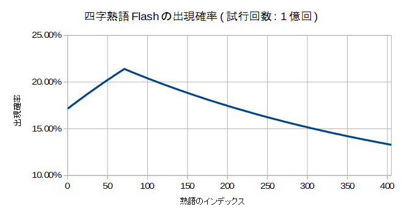

<!-- TOC depthFrom:1 depthTo:2 -->

- [四字熟語Flash RTA攻略](#四字熟語flash-rta攻略)
  - [どんなゲーム？](#どんなゲーム)
  - [RTAの歴史](#rtaの歴史)
  - [基本戦略](#基本戦略)
  - [小ネタ](#小ネタ)
  - [見つけやすい熟語](#見つけやすい熟語)
  - [取り違えやすい熟語](#取り違えやすい熟語)

<!-- /TOC -->

# 四字熟語Flash RTA攻略

----

## どんなゲーム？

- ランダムに配置された漢字をマウスで入れ替えて四字熟語を作るFlashゲー。使用されている熟語は405種類、漢字は719種類。どうやら2004年末辺りから存在しているらしい。
- 漢字をクリックしたときや熟語を揃えたときの効果音の中毒性、そして感動のエンディングに定評がある。
- 用意された熟語を全て揃えるとSTAGEクリア。最初のSTAGE 1で揃える熟語は4個だけだが、最後のSTAGE 7ではその4倍の16個もの熟語を揃える必要がある。

| STAGE | 熟語の数 |
| :---: | :---: |
| 1 | 4 |
| 2 | 6 |
| 3 | 8 |
| 4 | 10 |
| 5 | 12 |
| 6 | 14 |
| 7 | 16 |
| 合計 | 70 |

- RTAの計測区間は、「タイトル画面右下隅のGAME STARTボタンをクリックした瞬間」から「STAGE 7クリア後の効果音が鳴った瞬間」まで。
- [くまのプーさんのホームランダービー](https://kids.yahoo.co.jp/games/sports/013.html)同様、2020年末のFlashサポート終了による競技終了が危惧されている。Flash不使用の[スマホ対応版](https://www.gamedesign.jp/sp/yoji/)も存在するが操作が異なる上、4面までしかない。
- こんなゲームのRTAとか冗談に思われるかもしれないが、なかなかどうして、やりこむと奥が深いのです。

----

## RTAの歴史
- PeerCastという配信コミュニティで2010~2012年に流行り、記録集では100人以上の記録が登録されている(参考: [Peercast Record/四字熟語 - Peca視聴者Wiki](https://peca.nemusg.com/index.php?cmd=read&page=Peercast%20Record%2F%BB%CD%BB%FA%BD%CF%B8%EC))。
- 最速記録はArel.氏の3:40。比較的最近のプレイヤーだが唯一の3分台記録保持者であり、2位に30秒以上もの大差を付けている。
- SRCにも[Leaderboard](https://www.speedrun.com/Yojijukugo_Flash)がある。私がModeratorです。
<!-- - 2019年11月現在、4分台はその中でも6人しかいない。そして、その中で一番遅い4:59という記録を持っているのが自分(ping値)。 -->

## 基本戦略
### 熟語と「一確」の漢字を暗記する
「春」に対する「小春日和」や「森」に対する「森羅万象」のような、「この漢字はこの熟語でしか使用されていない」という「一確」の漢字を覚えておく。そういった熟語をメインに揃えていけば、必要な漢字が見つからない状況はかなり防げる。

### マウス操作は速度より精度を重視する
基本的に、「マウスで熟語を揃えること」と「周辺視野で漢字を把握すること」を同時に行う。そのため、マウス操作はどちらかというと速度より精度が求められる。

### 画面が上下に別れるSTAGE 4辺りからは、端から熟語を揃える
なるべく上下や左右から熟語を確定させることによって、終盤の視点移動やマウス移動を減らす。

| good | bad |
| :---: | :---: |
|  |  |

----

## 小ネタ
### 「一確」の中でも、見つけやすい漢字で構成される熟語を優先して揃える
「秋」に対する「一日千秋］、「孫」に対する「子々孫々」、「九」に対する「十中八九」など。こういった熟語があればラッキー。

### 一度登場した熟語はクリアまで出現しない仕様(「一攫千金」を除く)を利用する
例えば「折」は「和洋折衷」と「紆余曲折」でのみ使われている。だから「和洋折衷」が揃った場合、次に「折」を見つけたら「紆余曲折」確定と判断できる、など。  
例外として、データが二重登録されている「一攫千金」のみクリアまでに2回登場する可能性がある。

### 「無」を積極的に探す
「無」は2番目に出現頻度の高い漢字。出現頻度の高い他の「一」や「不」ほど目につきやすい形ではないが、探せばだいたいすぐ見つかるため、必要なら積極的に探してよい。

### 確実に複数ある漢字の探索を優先する
「足」(「自給自足」が確定)に対する「自」、「脱」(「誤字脱字」が確定)に対する「字」、「以」(「以心伝心」が確定)に対する心など。

### 熟語の出現率の偏り
このゲームは熟語をランダムに取り出すのに「熟語406個(405と「一攫千金」の二重入力で+1)の配列をシャッフル→先頭から順番に取り出す」という手順を踏んでいる。一様分布なら出現率は全て`(4+6+8+10+12+14+16)/406=約17.24%`になるが、シャッフルアルゴリズムに問題があるようで、実際の出現率には偏りがある。最大は「頑固一徹」の21.44%、最小は「避難訓練」の13.26%で、約1.6倍の開きがある。  
実際のプレイでは「竜」の「画竜点睛」(21.31%)と「竜頭蛇尾」(13.66%)くらい出現率に差があれば気にすべきかもしれない。


- [四字熟語の出現率一覧](./4ji-dist.txt)
- [四字熟語の出現率一覧(出現率で降順)](./4ji-dist-sorted.txt)

```
// flareで抽出した当該コード
    i = 0;
    while (i < jukugo_max) {
      r = Math.floor(Math.random() * jukugo_max);
      tmp = this['jukugo' + i];
      this['jukugo' + i] = this['jukugo' + r];
      this['jukugo' + r] = tmp;
      ++i;
    }
```
<!--

```
// Fisher-Yates アルゴリズム
    i = jukugo_max - 1;
    while (i > 0) {
      r = Math.floor(Math.random() * (i + 1));
      tmp = this['jukugo' + i];
      this['jukugo' + i] = this['jukugo' + r];
      this['jukugo' + r] = tmp;
      --i;
    }
```
-->

漢字の配置並び替えでも同じシャッフルアルゴリズムが使われているが、ややこしいのでそっちは気にしないことにする。なお、三時熟語Flashでも同様の偏りがある。


- [三時熟語の出現率一覧](./3ji-dist.txt)
- [三時熟語の出現率一覧(出現率で降順)](./3ji-dist-sorted.txt)

----

## 見つけやすい熟語

----

## 取り違えやすい熟語
