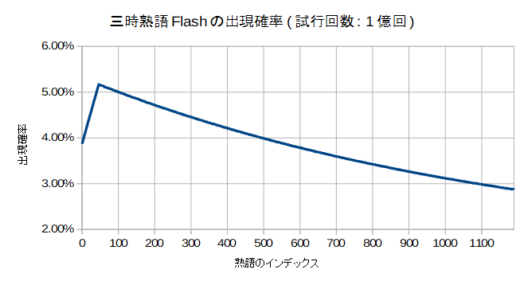

<!-- TOC depthFrom:1 depthTo:2 -->

- [四字熟語Flash RTA攻略](#四字熟語flash-rta攻略)
  - [どんなゲーム？](#どんなゲーム)
  - [RTAの歴史](#rtaの歴史)
  - [基本戦略](#基本戦略)
  - [小ネタ](#小ネタ)
  - [見つけやすい熟語](#見つけやすい熟語)
  - [取り違えやすい熟語](#取り違えやすい熟語)

<!-- /TOC -->

# 四字熟語Flash RTA攻略

----

## どんなゲーム？

- ランダムに配置された漢字をマウスで入れ替えて四字熟語を作るFlashゲー。使用されている熟語は405種類、漢字は719種類。どうやら2004年末辺りから存在しているらしい。
- 漢字をクリックしたときや熟語を揃えたときの効果音の中毒性、そして感動のエンディングに定評がある。
- 用意された熟語を全て揃えるとSTAGEクリア。最初のSTAGE 1で揃える熟語は4個だけだが、最後のSTAGE 7ではその4倍の16個もの熟語を揃える必要がある。

| STAGE | 熟語の数 |
| :---: | :---: |
| 1 | 4 |
| 2 | 6 |
| 3 | 8 |
| 4 | 10 |
| 5 | 12 |
| 6 | 14 |
| 7 | 16 |
| 合計 | 70 |

- RTAの計測区間は、「タイトル画面右下隅のGAME STARTボタンをクリックした瞬間」から「STAGE 7クリア後の じょーん という効果音が鳴った瞬間」まで。
- Flash不使用の[スマホ対応版](https://www.gamedesign.jp/sp/yoji/)も存在するが操作性が異なる上、4面までしかない。
- こんなゲームのRTAとか冗談に思われるかもしれないが、なかなかどうして、やりこむと奥が深いのです。

----

## RTAの歴史
- PeerCastという配信コミュニティで2010~2012年に流行り、記録集では100人以上の記録が登録されている(参考: [Peercast Record/四字熟語 - Peca視聴者Wiki](https://peca.nemusg.com/index.php?cmd=read&page=Peercast%20Record%2F%BB%CD%BB%FA%BD%CF%B8%EC))。
- 最速記録はArel.氏の3:40。比較的最近のプレイヤーだが唯一の3分台記録保持者であり、2位に30秒以上もの大差を付けている。
- SRCにも[Leaderboard](https://www.speedrun.com/Yojijukugo_Flash)がある。私がModeratorです。
- [くまのプーさんのホームランダービー](https://kids.yahoo.co.jp/games/sports/013.html)同様、2020年末のFlashサポート終了による競技終了が危惧されていると専らの噂である。[Adobe Flash Player - Debug Downloads](https://www.adobe.com/support/flashplayer/debug_downloads.html)からダウンロードできるFlash Player projectorを使えばスタンドアローンでyojijuku.swfを再生できるのでサポートが切れても安心！(たぶん)
<!-- - 2019年11月現在、4分台はその中でも6人しかいない。そして、その中で一番遅い4:59という記録を持っているのが自分(ping値)。 -->

## 基本戦略
### 熟語と「一確」の漢字を暗記する
「春」に対する「小春日和」や「森」に対する「森羅万象」のような、「この漢字はこの熟語でしか使用されていない」という「一確」の漢字を覚えておく。そういった熟語をメインに揃えていけば、必要な漢字が見つからない状況はかなり防げる。

### マウス操作は速度より精度を重視する
基本的に、「マウスで熟語を揃えること」と「周辺視野で漢字を把握すること」を同時に行う。そのため、マウス操作はどちらかというと速度より精度が求められる。

### 画面が上下に別れるSTAGE 4辺りからは、端から熟語を揃える
なるべく上下や左右から熟語を確定させることによって、終盤の視点移動やマウス移動を減らす。

| good | bad |
| :---: | :---: |
|  |  |

----

## 小ネタ
### 「一確」の中でも、見つけやすい漢字で構成される熟語を優先して揃える
「秋」に対する「一日千秋］、「孫」に対する「子々孫々」、「九」に対する「十中八九」など。こういった熟語があればラッキー。

### 一度登場した熟語はクリアまで出現しない仕様(「一攫千金」を除く)を利用する
例えば「折」は「和洋折衷」と「紆余曲折」でのみ使われている。だから「和洋折衷」が揃った場合、次に「折」を見つけたら「紆余曲折」確定と判断できる、など。  
例外として、データが二重登録されている「一攫千金」のみクリアまでに2回登場する可能性がある。

### 「無」を積極的に探す
「無」は2番目に出現頻度の高い漢字。出現頻度の高い他の「一」や「不」ほど目につきやすい形ではないが、探せばだいたいすぐ見つかるため、必要なら積極的に探してよい。

### 確実に複数ある漢字の探索を優先する
「足」(「自給自足」が確定)に対する「自」、「脱」(「誤字脱字」が確定)に対する「字」、「以」(「以心伝心」が確定)に対する心など。

### 熟語の出現率の偏り
このゲームは熟語をランダムに取り出すのに「熟語406個(405と「一攫千金」の二重入力で+1)の配列をシャッフル→先頭から順番に取り出す」という手順を踏んでいる。一様分布なら出現率は全て`(4+6+8+10+12+14+16)/406=約17.24%`になるが、シャッフルアルゴリズムに問題があるようで、実際の出現率には偏りがある。最大は「頑固一徹」の21.44%、最小は「避難訓練」の13.26%で、約1.6倍の開きがある。  
実際のプレイでは「竜」の「画竜点睛」(21.31%)と「竜頭蛇尾」(13.66%)くらい出現率に差があれば気にすべきかもしれない。


- [四字熟語の出現率一覧](./4ji-dist.txt)
- [四字熟語の出現率一覧(出現率で降順)](./4ji-dist-sorted.txt)

```
// flareで抽出した当該コード
    i = 0;
    while (i < jukugo_max) {
      r = Math.floor(Math.random() * jukugo_max);
      tmp = this['jukugo' + i];
      this['jukugo' + i] = this['jukugo' + r];
      this['jukugo' + r] = tmp;
      ++i;
    }
```
<!--

```
// Fisher-Yates アルゴリズム
    i = jukugo_max - 1;
    while (i > 0) {
      r = Math.floor(Math.random() * (i + 1));
      tmp = this['jukugo' + i];
      this['jukugo' + i] = this['jukugo' + r];
      this['jukugo' + r] = tmp;
      --i;
    }
```
-->

漢字の配置並び替えでも同じシャッフルアルゴリズムが使われているが、ややこしいのでそっちは気にしないことにする。なお、三時熟語Flashでも同様の偏りがある。


- [三時熟語の出現率一覧](./3ji-dist.txt)
- [三時熟語の出現率一覧(出現率で降順)](./3ji-dist-sorted.txt)

----

## 見つけやすい熟語

個人差ありあり。

| 熟語 | 確定の漢字 |
| :---: | :---: |
| 一期一会 | 会 |
| 一朝一夕 | 夕 |
| 一日千秋 | 秋 |
| 津々浦々 | 浦 |
| 子々孫々 | 孫 |
| 三々五々 | |
| 五臓六腑 | 臓or腑 |
| 五分五分 | |
| 七転八倒<br>七転八起 | 七 |
| 十中八九 | 九 |
| 十人十色 | |
| 四方八方 | |
| 四苦八苦 | |
| 四六時中 | |
| 正々堂々<br>威風堂々 | 堂 |
| 二束三文 |
| 二人三脚 | 脚 |
| 二転三転 | |
| 魑魅魍魎 | 全て |
| 一筆啓上 | 筆or啓 |
| 以心伝心 | 以 |
| 開口一番 | 番 |
| 国士無双 | 双 |
| 自縄自縛 | 縄or縛 |
| 波乱万丈 | 丈 |

----

## 取り違えやすい熟語

ニ字以上共通している熟語。

| 熟語 | 共通の漢字 | 確定方法 |
| :---:  | :---:  | :---:  |
| 整理整頓<br>理路整然 | 整・理 | 頓: 整理整頓<br>路: 理路整然 |
| 栄枯盛衰<br>盛者必衰 | 盛・衰 | 枯: 栄枯盛衰 |
| 異口同音<br>大同小異 | 異・同 |
| 一世一代<br>世代交代 | 世・代 |
| 行方不明<br>一方通行<br>品行方正 | 行・方 |
| 行方不明<br>不言実行 | 行・不 |
| 右往左往<br> 左右対称 | 右・左 | 往: 右往左往<br>称: 左右対称 |
| 海千山千<br>山海珍味 | 海・山 | 珍: 山海珍味 |
| 奇々怪々<br>複雑怪奇 | 奇・怪 | 雑: 複雑怪奇 |
| 千変万化<br>妖怪変化 | 変・化 | 妖: 妖怪変化 |
| 神出鬼没<br>鬼子母神 | 神・鬼 | 没: 神出鬼没<br>母: 鬼子母神 |
| 津々浦々<br>興味津々 | 津・々 | 浦: 津々浦々<br>興: 興味津々 |
| 挙動不審<br>一挙一動<br>軽挙妄動 | 挙・動 | 審: 挙動不審<br>軽: 軽挙妄動 |
| 焼肉定食<br>弱肉強食 | 肉・食 | 焼: 焼肉定食 |
| 古今東西<br>東奔西走 | 東・西 | 古or今: 古今東西<br>走: 東奔西走 |
| 自由自在<br>自由奔放 | 自・由 |
| 言語道断<br>横断歩道 | 道・断 |
| 言語道断<br>大言壮語 | 言・語 | 壮: 大言壮語 |
| 時代錯誤<br>試行錯誤 | 錯・誤 | 試: 試行錯誤 |
| 事実無根<br>有名無実 | 実・無 |
| 七転八倒<br>七転八起 | 七・転・八 |
| 四苦八苦<br>四方八方 | 四・八 |
| 徹頭徹尾<br>竜頭蛇尾 | 頭・尾 | 蛇: 竜頭蛇尾 |
| 心機一転<br>一心同体<br>一心不乱 | 心・一 |
| 安全第一<br>第一人者 | 第・一 |
| 第一人者<br>二者択一 | 一・者 |
| 第一人者<br>一人二役 | 一・人 |
| 二者択一<br>一人二役 | 一・ニ |
| 大義名分<br>大名行列 | 大・名 |
| 多事多難<br>多種多様<br>多情多感 | 多*2 |
| 三日天下<br>天下泰平 | 天・下 | 泰: 天下泰平 |
| 二束三文<br>二転三転<br>二人三脚 | 二・三 | 脚: 二人三脚 |
| 八方美人<br>四方八方 | 八・方 |
| 八方美人<br>美人薄命 | 美・人 |
| 百発百中<br>一発必中 | 発・中 |
| 不可抗力<br>不可思議 | 不・可 | 抗: 不可抗力<br>議: 不可思議 |
| 有名無実<br>事実無根 | 無・実 |
| 不言実行<br>実力行使 | 言・行 | 使: 実力行使 |
| 不平不満<br>不眠不休<br>不老不死 | 不*2 | 眠: 不眠不休 |
| 三日天下<br>三日坊主 | 三・日 | 坊: 三日坊主 |
| 名誉毀損<br>名誉挽回 | 名・誉 | 毀or損: 名誉毀損<br>挽: 名誉挽回 |
| 油断大敵<br>大胆不敵 | 大・敵 | 油: 油断大敵 |
| 連日連夜<br>連戦連勝 | 連*2 |
| 日進月歩<br>生年月日 | 日・月 |
| 一念発起<br>一触即発<br>一発必中 | 一・発 | 触: 一触即発 |
| 有象無象<br>有名無実 | 有・無 |
| 音信不通<br>不協和音 | 音・不 |
| 半死半生<br>起死回生 | 死・生 |
| 半死半生<br>半信半疑 | 半*2 |
| 喜色満面<br>得意満面 | 満・面 |
| 起承転結<br>七転八起 | 起・転 | 承or結: 起承転結 |
| 強迫観念<br>固定観念 | 観・念 | 迫: 強迫観念 |
| 前人未踏<br>前代未聞 | 前・未 | 踏: 前人未踏<br>聞: 前代未聞 |
| 前途多難<br>多事多難 | 多・難 |
| 天変地異<br>天地無用 | 天・変 |
| 天変地異<br>突然変異 | 変・異 |
| 年中無休<br>無我夢中 | 中・無 | 夢: 無我夢中 |
| 傍若無人<br>人畜無害 | 無・人 | 傍: 傍若無人<br>畜害: 人畜無害 |
| 百花繚乱<br>一目瞭然 | - | 繚(糸偏): 百花繚乱<br>瞭(目偏): 一目瞭然 |
| 才気煥発<br>阿鼻叫喚 | - | 煥(火偏): 才気煥発<br>喚(口偏): 阿鼻叫喚 |
| 大器晩成<br>名誉挽回 | - | 晩(日偏): 大器晩成<br>挽(手偏): 名誉挽回 |
| 粗製濫造<br>先祖代々 | - | 粗(米偏): 粗製濫造<br>祖(示偏): 先祖代々 |
| 風光明媚<br>眉目秀麗 | - | 媚(女偏): 風光明媚<br>眉: 眉目秀麗 |
