<!-- TOC depthFrom:1 depthTo:3 insertAnchor:false orderedList:false -->

- [北海 (North Sea)](#北海-north-sea)
  - [#1](#1)
  - [#2](#2)
  - [#3](#3)
  - [#4](#4)
  - [#5](#5)
  - [#6](#6)
  - [#7](#7)
  - [#8](#8)

<!-- /TOC -->

----

# 北海 (North Sea)

## #1

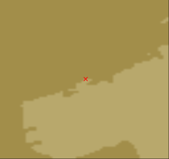  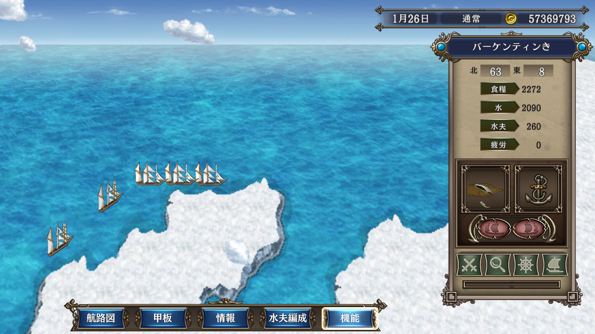

----

## #2

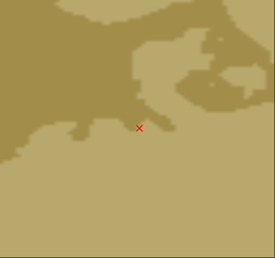  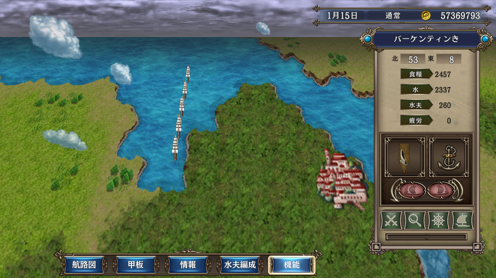

----

## #3

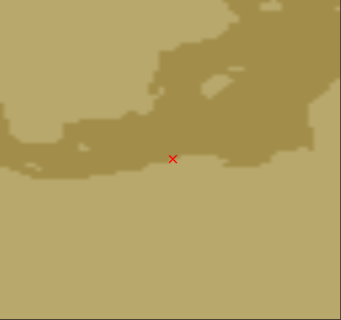  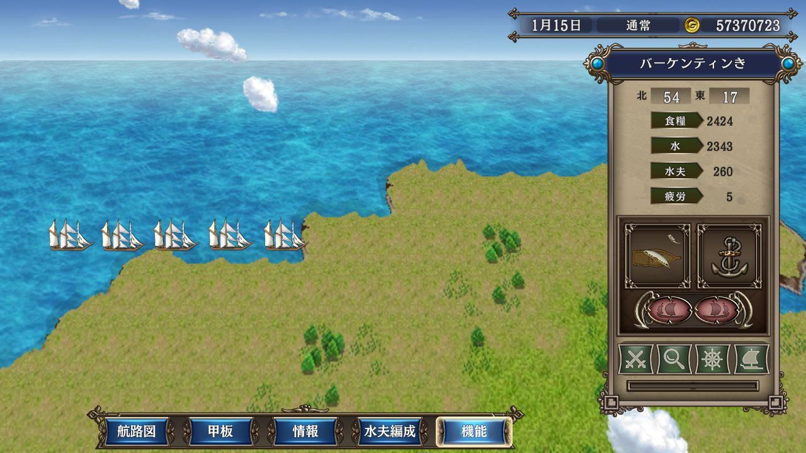

----

## #4

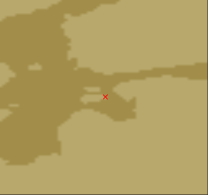 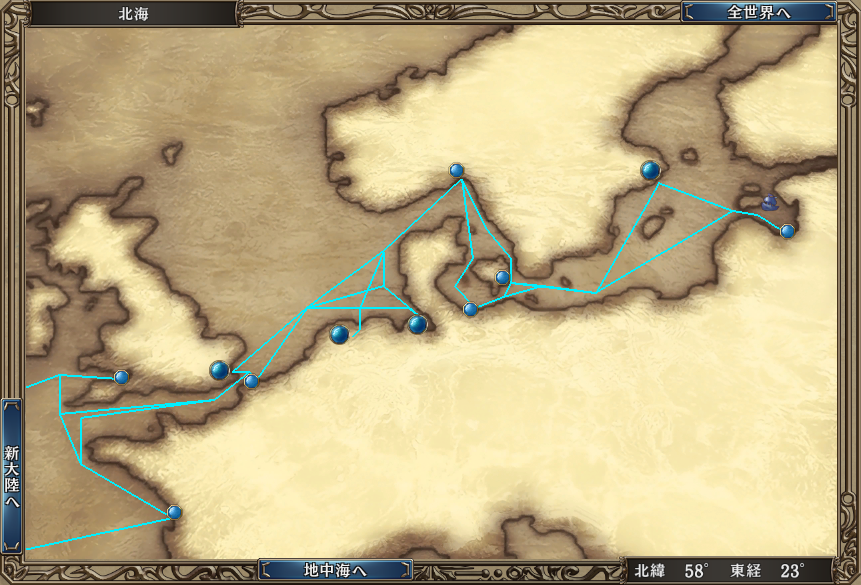 

----

## #5

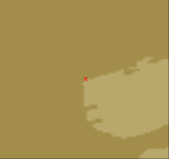 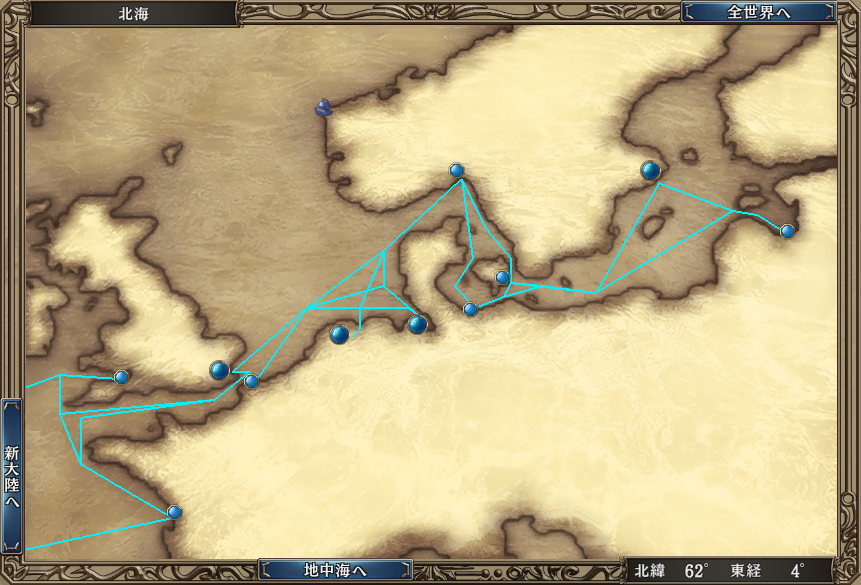 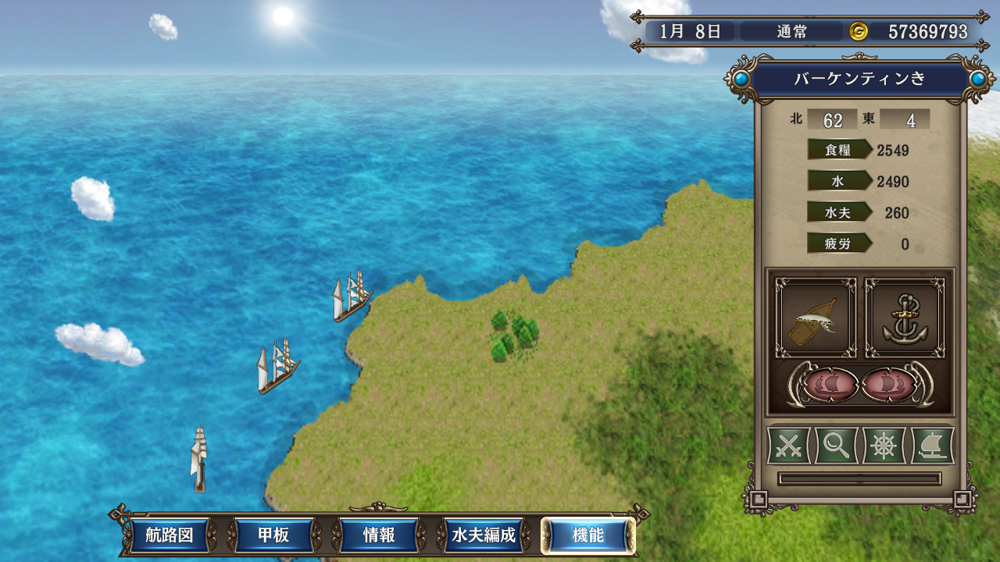

----

## #6

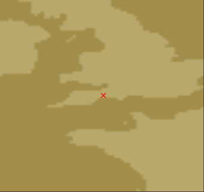  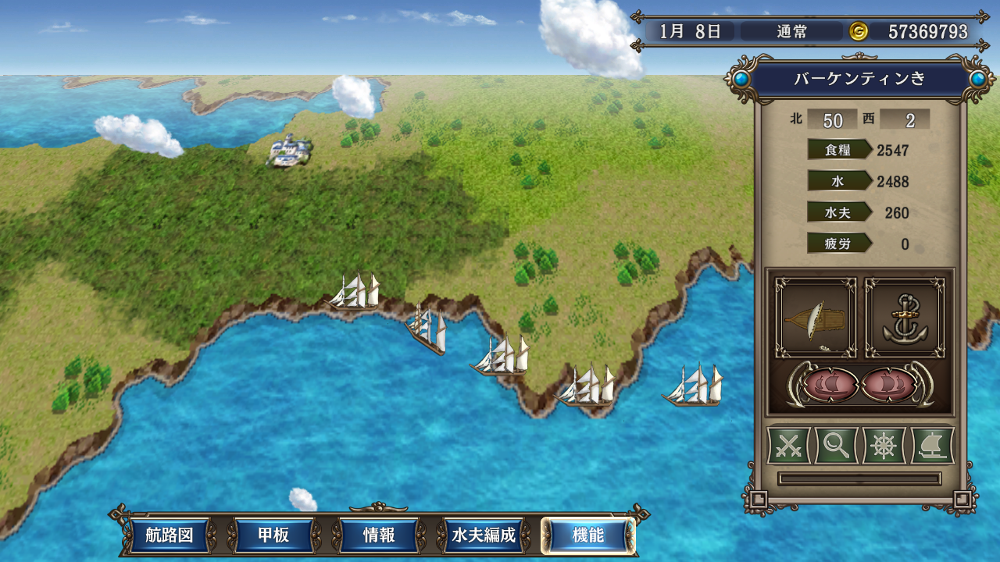

----

## #7

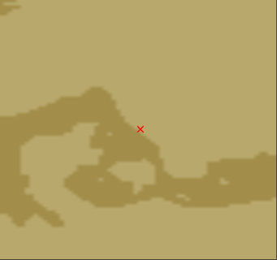  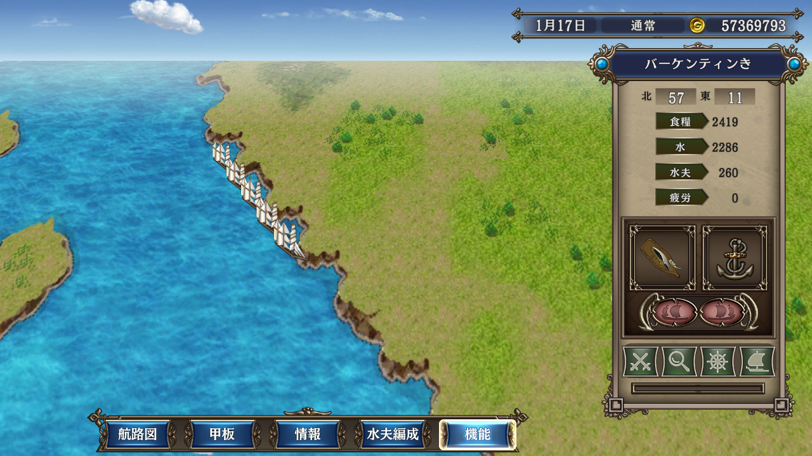

----

## #8

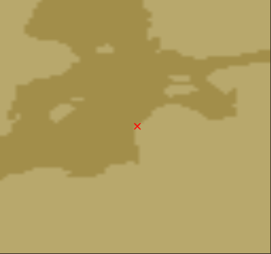  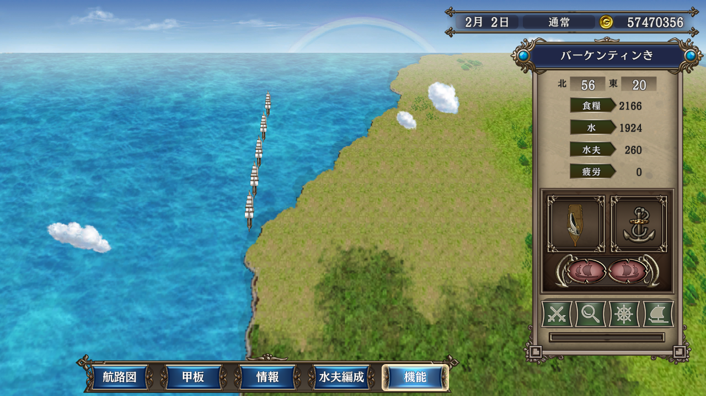

----

