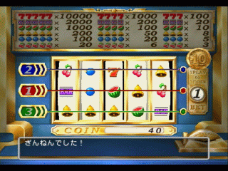
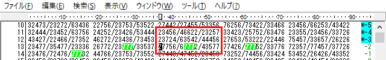
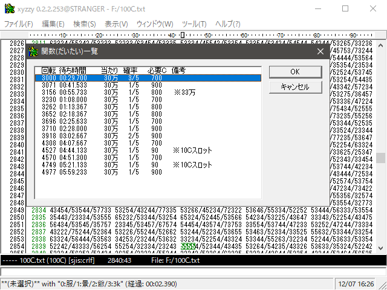
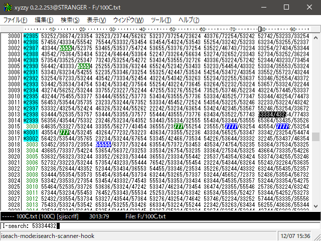

<!-- TOC depthFrom:1 depthTo:2 -->

- [実際の手順](#実際の手順)
  - [参考動画(プレイ映像のみ)](#参考動画プレイ映像のみ)
  - [30万枚まで](#30万枚まで)
  - [60万枚まで](#60万枚まで)

<!-- /TOC -->

# 実際の手順
※カジノ技についての知識がある前提の解説になっています。また、完全に自分の戦略での使い方(当て方)を想定しています。ごめんなさい。

## 参考動画(プレイ映像のみ)
- [リセット後のデータロードから](http://www.youtube.com/watch?v=QRIT0Vi0xvc#t=01h17m48s)
- [3000回転前の現在地特定から](http://www.youtube.com/watch?v=QRIT0Vi0xvc#t=01h27m37s)

## 30万枚まで

casino-modeを導入しておいたxyzzyを前もって起動しておく。**出目を検索するにあたってカーソルの位置は重要な要素なので、不用意にカーソルを動かさないこと。**

オラクルベリー教会のセーブデータをロード後、ほぼ最速で一番左の10Cスロットに右側から入り、出目を見る。

[出目表の文字と絵柄の対応表](./README.md#出目表の文字と絵柄の対応表)を参考に、`C-s`を押して出目のインクリメンタルサーチを行う(検索時の入力は`/`を省略できる)。1000n枚の当たり目の2回転前に位置している(-4-3)。  
**インクリメンタルサーチを終えるときは`Enter`キーでカーソルをその位置に残す**。逆に検索前の位置に戻りたいときは`C-g`を押して中断するとよい。

ラインが合っているため、無駄回転1回でコイン2000枚が当たる(-2-3)。

**1000枚(できれば2000枚)以上当たった場合、スロットを回している間に大当たり狙いの準備を済ませること。カーソルを当たり目まで動かし、**

**`TAB`キーで100Cの表に切り替えておく**。現在の表が10Cと100Cのどちらかを確認するには、xyzzyの下の黒いラインの左側を見ればよい。

大当たりを狙うための元手を手に入れたため、100Cスロットへ移動する。10Cスロットの-2,-1回転を当てた場合、最短距離で100Cスロットへ移動すれば19回転の大当たりの直前に入れる。今回は運よくラインが合い、大当たりの2回転前に入った(17-1)。

ラインが合っているため、無駄回転1回で30万が当たる。

## 60万枚まで

30万枚戦略ならこれでスロットを終了するが、60万枚以上を狙う場合は続行。**カーソルの現在地が待ち時間タイマーの基準になるため、ここでも当たり目までカーソルを動かしておくこと**。

スロットを出ると同時に`F3`を押し、待ち時間タイマーを開始する。タイマーはxyzzyのステータスバーに表示される。当たり目一覧も同時に表示される。

次の大当たり(58回転)は7.000秒後。当たり目一覧から58回転を選択すると、**カーソルがその当たり目の少し前にジャンプし、更に、選んだ当たり目とカウントダウンタイマーが左下に表示される。このカウントダウンタイマーが0になった瞬間が、スロットに入るタイミングの目安である。**  
なお間違った当たり目を選択してしまった場合は、`C-a`を押せば当たり目一覧から選び直せる。`F3`を押すとタイマーの基準が変更されるので注意。

待ち時間タイマーが0になると同時にスロットに入り、出目を検索する。外れ(56-2)。

次の大当たり(123回転)は11.633秒後。

<!--  -->

またも外れ(121-4)。

次の大当たりは363回転にあるが、自分の戦略では既に大当たりを1回当てていれば、次は景品交換等を行いながら3/5の確率で当たる3000回転を狙う。8分0.333秒後。

このとき、`3`キーを押せば、待ち時間タイマーに3000回転狙いの場合の補正(+5.0s)を加えてくれる。補正をやめたい場合は再び同じキーを押す(トグル)。

待ち時間中に施設の出入りや移動を繰り返していると、暗転や乱数消費による誤差が積み重なって正確に狙うことが困難になるため、時間が来るor用事が一通り済んだら一度100Cスロットに入って現在地を特定する。2800回転辺りまで上にスクロールしてから検索するとよいだろう。

3000回転は29.700秒後。

3/5の確率で当たるはずの3000回転を狙う。現在地は大当たりの2回転前(2998-5)。

無駄回転1回で30万が当たる。これでスロット稼ぎを全て終えたため、xyzzyを終了してよい。

