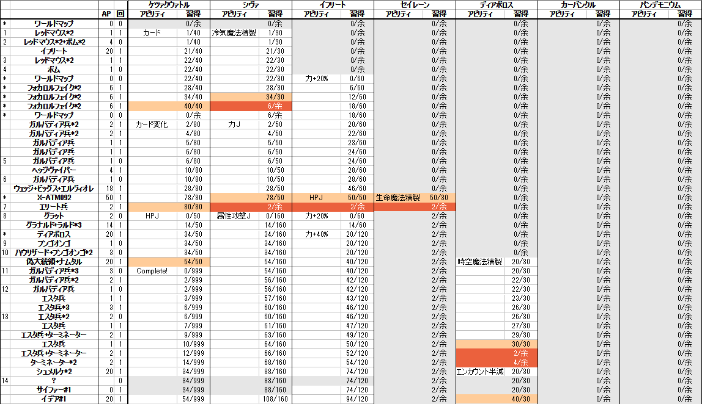
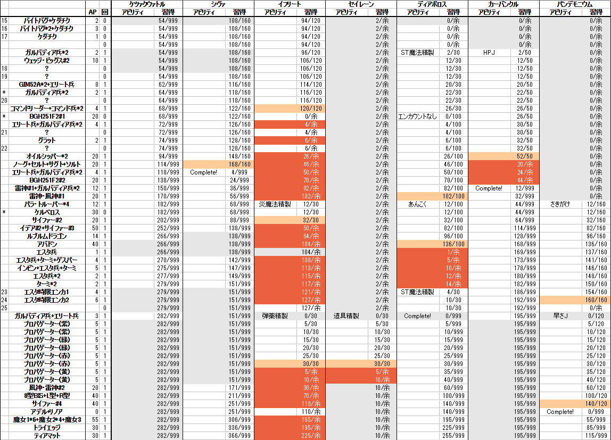

# ESA Summer 2022 PC版FF8

----

<!-- TOC depthFrom:1 depthTo:3 insertAnchor:false orderedList:false -->

- [ESA Summer 2022 PC版FF8](#esa-summer-2022-pc版ff8)
  - [タイムテーブル(目安)](#タイムテーブル目安)
  - [戦略概要](#戦略概要)
  - [重要な精製ルート](#重要な精製ルート)
  - [RTAにおけるPS版とPC版の主な違い](#rtaにおけるps版とpc版の主な違い)
  - [AGDQ 2020 からの戦略の変化](#agdq-2020-からの戦略の変化)
    - [キスティスカードの回収タイミングの変化](#キスティスカードの回収タイミングの変化)
    - [ECM](#ecm)
  - [RTA中の乱数の特定](#rta中の乱数の特定)
    - [ゼルカード取得(カード乱数)](#ゼルカード取得カード乱数)
    - [カーウェイ邸の番号の特定(フィールド乱数)](#カーウェイ邸の番号の特定フィールド乱数)
    - [最終パーティ操作(フィールド乱数)](#最終パーティ操作フィールド乱数)
  - [エスタ時限](#エスタ時限)
  - [回収するGFの重要度](#回収するgfの重要度)
    - [上](#上)
    - [中](#中)
    - [下](#下)
  - [AP管理表](#ap管理表)
    - [～DISC 1 終了](#disc-1-終了)
    - [DISC 2 開始～](#disc-2-開始)

<!-- /TOC -->

----

- [Bid](https://donations.esamarathon.com/bids/esa2022s1)
- [Final Fantasy VIII - speedrun.com](https://www.speedrun.com/ff8/full_game#PC)
- 走者
  - [awesomewaves](https://www.speedrun.com/user/awesomewaves)
    - アイルランド人走者
      - FF8RTAの文化祭イベントではアイリッシュジグを毎回選択する。
    - [PC版Turboなし 7h28m21s(1位)](https://www.speedrun.com/ff8/run/zq0jge1y)
      - [WR更新を確信しMelodies of Lifeを弾く男2022](https://www.twitch.tv/videos/1284861710?t=07h25m12s)
  - [Olson](https://www.speedrun.com/user/Olson)
    - ポーランド人走者
    - [PC版Turboなし 7h32m38s(6位)](https://www.speedrun.com/ff8/run/m774ew4m)
    - [PC版Turboあり 7h29m30s(2位)](https://www.speedrun.com/ff8/run/zp938jvm)
  - [bodcap](https://www.speedrun.com/user/bodcap)
    - イギリス人走者
    - [PC版Turboなし 7h28m55s(3位)](https://www.speedrun.com/ff8/run/zq04w15y)
- 資料
  - [**英仏対訳表**](https://gamefaqs.gamespot.com/ps/197343-final-fantasy-viii/faqs/49683)
  - [**日英対訳表**](https://finalfantasy.fandom.com/wiki/Final_Fantasy_VIII_translations)
  - [AGDQ 2020向けに自分の書いた記事](https://rtagamers.com/rpg/post-1343/)
  - [awesomewaves氏による攻略チャート](https://drive.google.com/file/d/1_jmWYWjOk6db6cfWmlD0eXX9oiiGC-Vm/view)

----

## タイムテーブル(目安)

|  | タイマー(目安) |
| :---: | :---: |
| Bid War: Squall's Name (スコールの名前) | 00:03 |
| サカナのヒレ稼ぎ | 00:15 |
| X-ATM092戦 | 00:45 |
| ディアボロス戦 | 01:15 |
| Bid War: Angelo's Name 🐕 (アンジェロの名前) | 01:30 |
| Bid War: Rinoa's Name (リノアの名前) | 01:30 |
| カーウェイ邸の番号の特定 | 02:15 |
| Bid War: Griever's Name (グリーヴァの名前) | 05:00 |
| Bid: Blindfolded Esthar Menu (目隠しエスタ時限) | 06:00 |
| Eyes on Me (skipされるかも) | 06:40 |
| 最終パーティ操作 | 07:10 |
| Bid: Defeat Omega Weapon (オメガウェポン撃破) | 07:30 |

----

## 戦略概要

**力を上げて物理で殴る**。物理攻撃ダメージの計算式には**力の2乗**が含まれているため、力を上げると物理攻撃ダメージが飛躍的に上昇する。

力に強力な魔法をジャンクションし、力+N%のアビリティをセットすることにより、力を上げて物理で殴る。そのためには**キスティスカード**と**ゼルカード**という2枚のレアカードの入手が重要。

----

## 重要な精製ルート

- サカナのヒレ\*5→(冷気魔法精製)→ウォータ\*100(力Jで力+20)
  - Zygène\*5→(Créa-Mgi-Gla)→H2O\*100
- キスティスカード→(カード変化)→ソウルオブサマサ\*3→(時空魔法精製)→トリプル\*180(力Jトリプル100で力+70)
  - Quistis→(Mode Carte)→Sacrum\*3→(Créa-Mgi-Temp)→Triple\*180
- ゼルカード→(カード変化)→ハイパーリスト*3(GFに使うと力+60%習得)
  - Zell→(Mode Carte)→Sagette*3
- イフリートカード→(カード変化)→エレメントアタック*3→(売却)→37500G
  - Ifrit→(Mode Carte)→Assaut Elé*3→(売却)→37500G
- テント\*10(10000G)→(生命魔法精製)→ケアルガ\*100(HPJでHP+2200)
  - Red Kross*10→(Créa-Mgi-Méd)→Soin Max\*100

----

## RTAにおけるPS版とPC版の主な違い

- ロード時間が短い。PC版のWRはPS版-50m。
- 縦横斜めの8方向以外への移動ができない。これにより、[リノアスキップ(リノア加入イベントのスキップ)](https://www.youtube.com/watch?v=Q5qHhc5nBLg)が不可能。+2m20s。
  - また、PS版ではワールドマップ上で斜め方向にアナログスティックで移動することで通常の約1.4倍の速さで移動できる、いわゆる√2走法ができたが、PC版ではできない。
- 言語を選択できる。最も速いフランス語版で走るものと予想される。Bonjour!

----

## AGDQ 2020 からの戦略の変化

### キスティスカードの回収タイミングの変化

キスティスカードはバラムガーデン食堂にいる「トゥリープFC会員01番」とのカード勝負で奪う。

従来は開始直後にキスティスカードを取りに行っていたが、現在は移動時間の短縮のため、イフリート撃破後にキスティスカードを取る(ちなみに、それだけのために裏で膨大な量のカード勝負手順の調査が行われている)。

一発勝負の場なので、従来の開幕キスティスカード取得を行うかも知れない。

### ECM

従来の戦略では偽大統領戦で習得する「カード変化」。これをドール実地試験のX-ATM092通称**カニ**を倒して50AP回収することで早期習得し、以降しばしの間いろいろ楽になるという戦略。これは[ECM (Early Card Mod)](https://drive.google.com/file/d/1_jmWYWjOk6db6cfWmlD0eXX9oiiGC-Vm/view)といって、海外のFF8走者[awesomewaves](https://www.speedrun.com/user/awesomewaves)氏が中心になって作られた戦略("Early Card Mod"を日本語に直すと「先カード変化」か)。

| | 従来戦略 | ECM |
| :---: | :---: | :---: |
| X-ATM092戦 | 連続剣1回+α→逃げる | 連続剣6回→起き上がり中に逃げ、50AP回収。 |
| SeeD試験結果待ち中 | メニュー操作量少ない | できることが増えたためメニュー操作量多い |
| グラナルド戦 | シヴァ召喚 + 連続剣 | スコールとキスティスで殴り倒す |
| ディアボロス戦 | ゼルのデュエル | キロスまたはウォードのリミット |
| 偽大統領戦 | セルフィのブリザガ | スコールの打撃 |

- X-ATM092が起き上がる前に連続剣を6回叩き込むのは一発勝負の場で行うにしてはシビアなので、バトルスピードを下げて挑むのではないかと予想している。
- X-ATM092の50APで「力J(シヴァ)」「HPJ(イフリート)」「生命魔法精製(セイレーン)」を習得。
  - 「カード変化(ケツァクウァトル)」は、帰り道のエリート兵を撃破したときに習得。
- SeeD試験結果待ち中は後述するエスタ時限のような自由時間があり、ここではロスなくメニュー操作を行える。
- ディアボロスをゼルのデュエル1回で撃破するのは難しく、走者の腕の見せ所でもあったが、ECMでは楽。タイムも-1m。
- 従来の戦略との違いがあるのはラグナ編2回目までであり、ラグナ編2回目より後はほぼ同じ流れになる。

----

## RTA中の乱数の特定

これらの乱数特定は[Resources - Final Fantasy VIII - speedrun.com](https://www.speedrun.com/ff8/resources)にある**FF8 Utilities**で行える。やってみよう！！！

### ゼルカード取得(カード乱数)

ゼルカードを持つゼルママがゼルカードを使用する確率は10%。だが、カード乱数の現在値を特定し、19f(約0.32s)の目押しを行うことで確実に入手できる。

カード勝負中のランダム要素に関わる「カード乱数」はなぜか戦闘でも使用される。**エンカウントの内容**・**敵味方の行動**・**終了時のカメラアングル**を見ておくことで、ゼルママとのカード勝負時のカード乱数の値を特定することが可能(開始直後にキスティスカードを取得する場合はその時のCPUの手札情報も必要)。

### カーウェイ邸の番号の特定(フィールド乱数)

カーウェイ邸の門番に要求される3桁の数字。本来は「名もなき王の墓」まで確認しにいく必要がある。

実はこの番号は、デリングシティのエレベーターを上った時点のフィールド乱数によって決定される。デリングシティへ向かう**電車の窓から見える電柱(pole)の数**で乱数の値がわかるので、それを元に番号を特定できる。名もなき王の墓へ寄り道する必要はない。

### 最終パーティ操作(フィールド乱数)

ラスボス戦で戦闘メンバーがランダムに選出されるが、これもフィールド乱数が用いられている。
アデル撃破後の**ムービー中のスコールの動き**から乱数の値が特定できる。その後、ムービー中に一定時間放置するまたはドローポイントを調べることで目的のパーティになるよう乱数を消費する。

BidのDefeat Omega Weapon(オメガウェポン撃破)が達成されたら、また別の方法をとるかも知れない。

最終パーティ操作はセーブ＆リセによるフィールド乱数の初期化でも可能。PS版は1mロスだがPC版はそれより少ない20sロスで済むので、アルティミシア城前でセーブ＆リセを行うかもしれない。

----

## エスタ時限

RTA終盤のエスタでは5分間の自由時間が与えられる。この時間を使って、この時点でできる可能な限りの行動を済ませること。FF8のRTAにおける走者のコマンド入力捌きの最大の見せ場。

[参考: Luzbelheim氏の目隠しエスタ時限 at AGDQ 2020](https://youtu.be/sSF9-3KdauA?t=25869)

主にやること一覧

- エンカウント2回起こす
  - 撃破してAPを稼ぐ
    - ST魔法精製・さきがけの習得(さきがけは習得しないかも)
  - GIM52Aからヘイストをドロー
- 店
  - ロゼッタ石回収
  - メガポーションを売却し、HPの書・力の書・忘れ草を購入
- メニュー操作
  - アイテム
    - 忘れ草で邪魔なアビリティを削除
    - 力の書・HPの書・ロゼッタ石をGFに使用し、力J・HPJ・アビリティx4を習得させる
    - 弾薬精製用のアイテムをアクセスしやすい位置に配置
  - 魔法
    - ラスボスの魔法消滅消滅からトリプルやケアルガを守るため並び替え
    - ヘイスト・バーサクを2人に分配
  - ジャンクション
    - ラスボスで選出された場合に備え、全員にGFをジャンクションし、アイテムコマンドをセット。

----

## 回収するGFの重要度

### 上
- イフリート (Ifrit)
  - **力J (Vgr-A)** - 習得済
  - **力+20% (Vgr+20%)** - 60AP
  - **力+40% (Vgr+40%)** - 120AP
  - HPJ (HP-A) - 50AP
  - 属性攻撃J (Atq-Elé-A) - 習得済※日本語版以外
  - **弾薬精製 (Créa-Balles)** - イフリートLv10・30AP
- ディアボロス (Nosferatu)
  - アビリティ×3 (Capacitéx3) - 習得済
  - **時空魔法精製 (Créa-Mgi-Temp)** - 30AP
  - **エンカウント半減 (Mi-Combat)** - 30AP
  - **エンカウントなし (No-Combat)** - 100AP
  - あんこく (Combustion) - 100AP

### 中
- ケツァクァトル (Golgotha)
  - **カード変化 (Mode Carte)** - 80AP
  - HPJ (HP-A) - 50AP
- シヴァ (Shiva)
  - **力J (Vgr-A)** - 50AP
- パンデモニウム (Zéphyr)
  - 力J (Vgr-A) - 習得済
  - 属性攻撃J (Atq-Elé-A) - 習得済
  - 早さJ (Vts-A) - 120AP
  - **さきがけ (Genki)** - 160AP

### 下
- セイレーン (Ondine)
  - 生命魔法精製 (Créa-Mgi-Méd) - 30AP
  - 道具精製 (Créa-Outils) - 30AP
- カーバンクル (Ahuri)
  - アビリティ×3 (Capacitéx3) -習得済
  - HPJ (HP-A) - 50AP

----

## AP管理表

だいたいこんな感じのハズ。

### ～DISC 1 終了

### DISC 2 開始～

