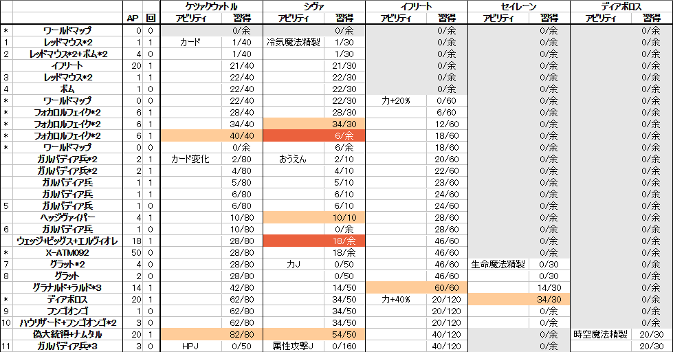

# 第7回FF駅伝 Dチーム FF8の序盤戦略([ECM](https://drive.google.com/file/d/1_jmWYWjOk6db6cfWmlD0eXX9oiiGC-Vm/view))について

現在の一般的な戦略では偽大統領戦で習得する「カード変化」。これをドール実地試験のX-ATM092通称**カニ**を倒して50AP回収することで習得し、以降、ラグナ編2回目までいろいろ楽になるという戦略。これは[ECM (Early Card Mod)](https://drive.google.com/file/d/1_jmWYWjOk6db6cfWmlD0eXX9oiiGC-Vm/view)といって、海外のFF8走者[awesomewaves](https://www.speedrun.com/user/awesomewaves)さんが中心になって作られた戦略("Early Card Mod"を日本語に直すと「早期カード変化」)。

ラグナ編2回目の後は一般的なゼルカードあり戦略とだいたい同じ。ECMはディアボロス戦が簡単に終わるのが面白いので採用してみた。ただ実はやや一発勝負向きではないと後から気付いた。

- 動画
  - [一般的なゼルカードあり](https://youtu.be/f_GBBcDyLbk)
  - [ECM](https://youtu.be/Kld1Ap4IeG4)
- テキスト
  - [一般的なゼルカードあり](http://pingval.g1.xrea.com/psff8/rta-chart/)
  - [ECM (英語)](https://drive.google.com/file/d/1_jmWYWjOk6db6cfWmlD0eXX9oiiGC-Vm/view)

## 一般的なゼルカードあり戦略との比較

- 利点
  - グラナルド戦用の微妙なスコールのHP調整が不要。
  - ディアボロス戦が非常に簡単。
  - 早期にイフリートにHPJを習得させる影響で、オイルシッパー戦でのスコールの最大HPが高い。スコールのHPを回復しておけば全体攻撃ソニックウェーブが連続しても全滅しないので、一発勝負でのセーフティセーブが不要。
- 欠点
  - 安定のためX-ATM092戦でBSを落としているせいもあって、一般的なゼルカードあり戦略より**30s程度遅れる**。
  - X-ATM092のノックダウン中にHPを削り切るだけの火力が必要なので、ヒレ4枚(力Jウォータ80)だとだめ。5枚(力Jウォータ100)必要。**一発勝負で微妙な最大の理由**。
  - 一定時間タイムロスなくメニュー操作できる試験結果待ち時間及びホテル地下のメニュー操作量が多い。エスタ時限ばりに詰め詰めで時間内に終わらせるのが難しい。

|差異のある地点|タイム差|一般的なゼルカードあり|ECM|
|:---:|:---:|:---:|:---:|
|X-ATM092戦前|+00:13|何もしない|[X-ATM092の50APを習得させたいアビリティに入れるメニュー操作を行う](https://youtu.be/Kld1Ap4IeG4?t=50m03s)|
|X-ATM092戦|**+01:35**|[連続剣1回+α](https://youtu.be/f_GBBcDyLbk?t=49m36s)|[連続剣5~7回でノックダウン中にHPを削り切って50AP回収し、HPJ(イフリート)・力J(シヴァ)・生命魔法精製(セイレーン)を習得](https://youtu.be/Kld1Ap4IeG4?t=50m39s)|
|X-ATM092戦BS|+00:23|BS最速|BS通常。一発勝負用の安全策|
|歩数エンカ7個目|+00:16|[逃げる(訓練施設の「グラット2」)](https://youtu.be/f_GBBcDyLbk?t=1h08m35s)|[ドールの酒場で「エリート兵」を引いて2AP回収。50APと併せてカード変化(ケツァルコアトル)を習得](https://youtu.be/Kld1Ap4IeG4?t=55m32s)|
|試験結果待ち|+00:00|[メニュー操作量少ない](https://youtu.be/f_GBBcDyLbk?t=59m14s)|[メニュー操作量多い](https://youtu.be/Kld1Ap4IeG4?t=1h03m14s)|
|グラナルド戦|-00:10|[連続剣とシヴァ](https://youtu.be/f_GBBcDyLbk?t=1h12m31s)|[打撃連打](https://youtu.be/Kld1Ap4IeG4?t=1h16m11s)|
|バラムショップ|+00:02|[切符購入のためエリクサー売却](https://youtu.be/f_GBBcDyLbk?t=1h20m34s)|[従来ティンバーショップでやっていた買い物](https://youtu.be/Kld1Ap4IeG4?t=1h21m49s)|
|ディアボロス戦|**-01:00**|[ゼルのデュエル](https://youtu.be/f_GBBcDyLbk?t=1h17m16s)|[ウォードのリミット2回(1回目でCritが出れば更に-20s)](https://youtu.be/Kld1Ap4IeG4?t=1h24m40s)|
|ホテル地下|+00:02|[メニュー操作量少ない](https://youtu.be/f_GBBcDyLbk?t=1h26m52s)|[メニュー操作量多い](https://youtu.be/Kld1Ap4IeG4?t=1h30m09s)|
|偽大統領戦|-00:08|[セルフィのブリザガ](https://youtu.be/f_GBBcDyLbk?t=1h42m32s)|[スコールのトリガー打撃](https://youtu.be/Kld1Ap4IeG4?t=1h45m49s)|
|ティンバーメニュー操作|-00:25|[カード変化等](https://youtu.be/f_GBBcDyLbk?t=1h47m04s)|何もしない(試験結果待ち中に済ませている)|
|ティンバーショップ|-00:07|[エレメントアタック売却、テント・散弾購入](https://youtu.be/f_GBBcDyLbk?t=1h48m54s)|寄らない|
|ラグナ編2回目メニュー操作|+00:05|何もしない|[HPジャンクション(戦闘開幕演出スキップのため)](https://youtu.be/Kld1Ap4IeG4?t=2h06m45s)|
|戦闘開幕演出スキップ|-00:16|なし|[ラグナ編2回目の7戦とD地区収容所ゼル単騎戦闘](https://youtu.be/Kld1Ap4IeG4?t=2h07m55s)|
|合計|+00:30|||

## AP管理表
### 一般的なゼルカードあり
最初の歩数エンカ「レッドマウス*2」2匹とも倒して2AP稼ぐことも。

### ECM

## 本番セーブ予定箇所

おまけどす

1. DISC 1 ディアボロス戦前(ディアボロスの行動次第では危険なのと、難しい序盤を抜けたとこなので)
1. DISC 1 終了
1. DISC 2 終了
1. DISC 4 魔女連戦前(炎の洞窟の魔女さんメテオはやめてお)
1. DISC 4 アルティミシア城前(アーヴァインがグリーヴァに殺される可能性が僅かにある。またノーリセ最終パーティ操作失敗時の保険)
