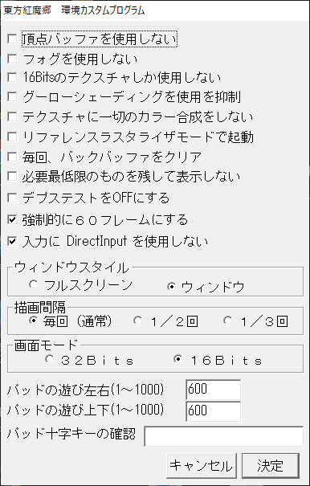
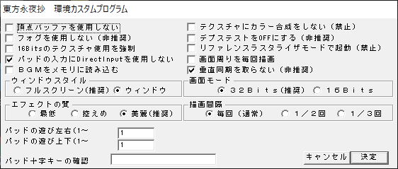
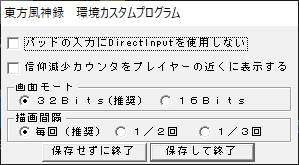

| No. | 作品名 | custom.exe | OPTION画面 |
| :---: | :---: | :---: | :---: |
| 06 | 紅魔郷 |  |  |
| 07 | 妖々夢 |  |  |
| 08 | 永夜抄 |  |  |
| 09 | 花映塚 |  |  |
| 09.5 | 文花帖 |  |  |
| 10 | 風神録 |  |  |
| 11 | 地霊殿 |  |  |
| 12 | 星蓮船 |  |  |
| 12.5 | ダブルスポイラー |  |  |
| 12.8 | 妖精大戦争 |  |  |
| 13 | 神霊廟 |  |  |
| 14 | 輝針城 |  |  |
| 14.3 | 弾幕アマノジャク |  |  |
| 15 | 紺珠伝 |  |  |
| 16 | 天空璋 |  |  |
| 16.5 | 秘封ナイトメアダイアリー |  |  |
| 17 | 鬼形獣 |  |  |
| 18 | 虹龍洞 |  |  |
