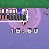

<!-- TOC depthFrom:1 depthTo:3 insertAnchor:false orderedList:false -->

- [RTAで　楽しく　遊ぶ](#rtaで　楽しく　遊ぶ)
  - [はじめに](#はじめに)
  - [RTAとは](#rtaとは)
  - [Lunatic](#lunatic)
    - [SRCルール(Easy~Lunaticで共通)](#srcルールeasylunaticで共通)
    - [戦略概要](#戦略概要)
  - [Lunatic以外の難易度](#lunatic以外の難易度)
    - [Hard](#hard)
    - [Easy, Normal](#easy-normal)
  - [Extra](#extra)
    - [戦略概要(一発勝負)](#戦略概要一発勝負)
    - [戦略概要(記録狙い)](#戦略概要記録狙い)
  - [No Restrictions](#no-restrictions)
    - [SRCルール](#srcルール)
    - [戦略概要(記録狙い)](#戦略概要記録狙い-1)
  - [LiveSplitとAutoSplitter](#livesplitとautosplitter)
  - [おわりに](#おわりに)
  - [脚注](#脚注)

<!-- /TOC -->

----

# RTAで　楽しく　遊ぶ

筆者: [ping値](http://twitter.com/pingval)

## はじめに

初めまして、或いはお久しぶり。筆者はかつて[LET](https://wikiwiki.jp/let/)の名で花映塚の同人攻略本『アル花ディア ～東方花映塚攻略ノススメ～』(弾幕研究室)の解析を担当したり、みくり屋の名でvip及びしたらば掲示板で花映塚対戦をしていた者だ。

現在はRTA界隈にどっぷり浸かっている筆者だが、ping値という名は花映塚配信に凸したとき「ping値のmaxが高い人」と呼ばれたことに由来していて、実は花映塚に縁のある名だったりする。

筆者が花映塚のRTAに手を出したのは2018年の6月頃。ニコニコ動画に2017年5月に投稿されていた2本のLunatic RTA動画([11:56](https://www.nicovideo.jp/watch/sm31246205)と[10:19](https://www.nicovideo.jp/watch/sm31290487))を視聴して興味を持ったのがきっかけだった。その年の8月のオンラインRTAイベント『[RTA in Japan Online 2](https://www.twitch.tv/collections/Bo4GSqK_SRW97A)』に応募してみたらなぜか厳選枠で採用されて戸惑った覚えがある。

この記事では、そんな筆者が花映塚のRTAについて色々と書いていく。

  
([『RTA in Japan Online 2』の花映塚](https://www.twitch.tv/videos/295934347)。プレイはさておき[2x4](https://twitter.com/nishi2x4)氏による軽妙な解説は必聴)

## RTAとは
[RTA(**Real Time Attack**)](https://ja.wikipedia.org/wiki/%E3%82%84%E3%82%8A%E8%BE%BC%E3%81%BF#%EF%BC%88%E3%83%AA%E3%82%A2%E3%83%AB%EF%BC%89%E3%82%BF%E3%82%A4%E3%83%A0%E3%82%A2%E3%82%BF%E3%83%83%E3%82%AF%EF%BC%88TA%EF%BC%89%E3%83%BB%E3%82%B9%E3%83%94%E3%83%BC%E3%83%89%E3%83%A9%E3%83%B3)とは**実時間でクリアするまでのタイム**を競う遊び方のこと。ゲームのやりこみサークル『[極限攻略研究会](http://kyokugen.sakura.ne.jp/)』がやりこみの1ジャンルとして[2000年頃に提唱した造語](http://rta.jp/begin1.html)であり、海外では[**Speedrun**](https://en.wikipedia.org/wiki/Speedrun)という呼び名が一般的だ。

RTAには大きく分けて、完走を大前提とする「**一発勝負**」と、突破率を犠牲にしてでも自己ベストや最速記録の更新を目的とする「**記録狙い**」の2通りの遊び方がある。ゲームやカテゴリによってこの2者の戦略はほぼ同じだったり全く違ったりする。花映塚ではどうかと言うと、Lunaticはあまり変わらないがExtraでは大きく異なる。

様々なRTAの記録集積所である『[**speedrun.com**](https://www.speedrun.com/)(以下SRC)』には[東方STGのリーダーボード](https://www.speedrun.com/touhou)も存在し、その中にはもちろん[花映塚](https://www.speedrun.com/touhou_kaeitzuka_phantasmagoria_of_flower_view)もある。現在あるカテゴリは[**Easy**](https://www.speedrun.com/touhou_kaeitzuka_phantasmagoria_of_flower_view#Easy)・[**Normal**](https://www.speedrun.com/touhou_kaeitzuka_phantasmagoria_of_flower_view#Normal)・[**Hard**](https://www.speedrun.com/touhou_kaeitzuka_phantasmagoria_of_flower_view#Hard)・[**Lunatic**](https://www.speedrun.com/touhou_kaeitzuka_phantasmagoria_of_flower_view#Lunatic)・[**Extra**](https://www.speedrun.com/touhou_kaeitzuka_phantasmagoria_of_flower_view#Extra)・[**No Restrictions**](https://www.speedrun.com/touhou_kaeitzuka_phantasmagoria_of_flower_view#No_Restrictions)の六つ。この記事では、そのうちLunatic・Extra・No Restrictionsを主に扱う。

  
(2021年2月現在の[speedrun.com](https://www.speedrun.com/)の[東方花映塚リーダーボード]((https://www.speedrun.com/touhou_kaeitzuka_phantasmagoria_of_flower_view)))

## Lunatic
最速記録は筆者の[**8:55**(メディスン)](https://www.speedrun.com/touhou_kaeitzuka_phantasmagoria_of_flower_view/run/y89qkp1m)。基本的にCPUキラーを使って**CPUが早く落ちてくれることを祈る運ゲー**。運ゲーではあるが、プレイヤーができることがないわけでもない。

  
(筆者の[8:55](https://www.twitch.tv/videos/274239649/)より。区間タイムが1m~2m以上とブレるラスボス戦は1番の運ゲー)

### SRCルール(Easy~Lunaticで共通)
>  Timing starts at shot type select and ends when Eiki/Reimu take their last hit. Replays allowed, 1cc only, default lives. "In-game time" is a placeholder for replay time  
> (自機選択時にタイマースタート、霊夢/映姫が最後の被弾をした瞬間にタイマーストップ。リプレイ可(動画不必須)、1コインクリアのみ(コンティニュー不可)、初期残機変更不可、”In-game time”はリプレイ計測タイムの代替)<strong><a id="content-rule1" href="#footnote-rule1">*1</a></strong>

リプレイ再生動画でも記録を申請できるが、リプレイのタイム(= In-game time)は実際のプレイよりも約20s短いため、リプレイ再生動画に20s加算されたタイムがReal Timeとして登録される。

### 戦略概要

#### テキストは全て飛ばす
当然だが、ステージ開始時・終了時のテキストは**Skipボタンで全て飛ばす**。ステージをクリアしたら次ステージで操作可能になるまでSkipボタンを押し続ける。

#### 自機はメディスンを使う
文は超高速かつ判定の大きいEXアタック「天狗烈風弾」によってCPUの超反応避けいわゆる**電動歯ブラシを貫通**して被弾を取れる。メディスンは自機移動速度を4割(複数重なると乗算)にするEXアタック「スウィートポイズン」で**電動歯ブラシを阻害**して被弾を取れる。この2人がCPUキラーとして有名だが、弾幕の厚いLunaticでの平均タイムはメディスンに軍配が上がる。メディスンは防御性能が高いため一発勝負向きでもある。タイムの”上ブレ”を期待する記録狙いでも、恐らくメディスンが優るだろう。

なお、一発勝負で文を使う場合は紙防御ぶりが顕わになる7面(メディスン)と9面(四季映姫)で残機を1回潰しCPUレベルを落とすことをお勧めする。残機潰しは12s経過直後に4回目の被弾を実行して1.5ダメ喰らうと被弾回数が1回減って速い(5.0→4.0→3.0→2.0→0.5)<strong><a id="content-lifesystem" href="#footnote-lifesystem">*2</a></strong>。

#### 開幕でライフを潰してゲージを稼ぎ、C2を連打する
12s経過前に4回被弾することでゲージを4本貯める。これを元手に即時C2を2回撃ち「おくりもの」のラリーをCPUと繰り返して**早い段階から弾幕を厚くし、CPUの早期被弾を狙う**。ライフは1.0残るのであと1回だけ被弾できる。とはいえ一発勝負の終盤8,9面では控えるのが無難だろう。

メディスンの「霊魂の体当たりを喰らわない」特性上幽霊でライフ潰しできない点、及びミスティア戦ではC2設置弾を弾消しリングで消さないよう最下段でC2を撃つ点に注意。

#### 幽霊を積極的に撃破する
幽霊を撃破すると高いEXポイントを得られるため。赤＞黄＞緑の順に高いことも意識する。

#### 6面以降は「経過時間12s未満またはCPUのライフ0.5」以外でなるべく被弾しない
CPU被弾時に底上げダメージ<strong><a id="content-cpudmg" href="#footnote-cpudmg">*3</a></strong>1.0が加算される5面まではCPUは被弾3回でほぼ間違いなく死ぬ。しかし底上げダメージが0となる**6面以降は、こちらの被弾タイミング次第でCPUが3回被弾しても死なない可能性がある**ため。

<table>
  <caption>Lunatic RTAの戦略(自機メディスン)</caption>
  <thead>
    <tr><th rowspan="2">面</th><th rowspan="2">CPUレベル<strong><a id="content-cpulv" href="#footnote-cpulv">*4</a></strong> (底上げダメージ)</th><th rowspan="2">CPUのキャラ</th><th rowspan="2">方針</th><th colspan="2">目安タイム(区間)</th></tr>
    <tr><th>一発勝負</th><th>記録狙い</th></tr>
  </thead>
  <tbody>
    <tr><th>1</th><td>12 (1.0)</td><td rowspan="2">ミスティア or リリカ</td><td rowspan="7">1R目開幕ライフ潰しでゲージ4本回収 ↓ C2*2で弾幕を厚く</td><td>1:00 (1:00)</td><td>0:55 (0:55)</td></tr>
    <tr><th>2</th><td>12 (1.0)</td><td>2:00 (1:00)</td><td>1:50 (0:55)</td></tr>
    <tr><th>3</th><td>12 (1.0)</td><td>てゐ</td><td>3:00 (1:00)</td><td>2:45 (0:55)</td></tr>
    <tr><th>4</th><td>15 (1.0)</td><td rowspan="2">霊夢 or 魔理沙 or 鈴仙</td><td>4:00 (1:00)</td><td>3:40 (0:55)</td></tr>
    <tr><th>5</th><td>18 (1.0)</td><td>5:00 (1:00)</td><td>4:35 (0:55)</td></tr>
    <tr><th>6</th><td>45 (0)</td><td>咲夜</td><td>6:20 (1:20)</td><td>5:35 (1:00)</td></tr>
    <tr><th>7</th><td>50 (0)</td><td>幽香</td><td>7:40 (1:20)</td><td>6:35 (1:00)</td></tr>
    <tr><th>8</th><td>50 (0)</td><td>小町</td><td rowspan="2">記録狙いの場合、1-7面と同様</td><td>9:00 (1:20)</td><td>7:35 (1:00)</td></tr>
    <tr><th>9</th><td>60 (0)</td><td>四季映姫</td><td>11:00 (2:00)</td><td>8:55 (1:20)</td></tr>
</table>

## Lunatic以外の難易度

### Hard
最速記録は筆者の[**9:57**(メディスン)](https://www.speedrun.com/touhou_kaeitzuka_phantasmagoria_of_flower_view/run/ywp3nv3z)<strong><a id="content-hardwr" href="#footnote-hardwr">*5</a></strong>。Lunaticよりも1分ほど遅い。難易度が下がるほど弾幕は薄くなるため、**対CPU攻撃力が弾幕の厚さに依存する**メディスンはタイムが延びてしまうのだ。

最速記録を出したときのプレイ方針はLunaticとほぼ一緒だったが、それに加えて**5面まではライフを0.5まで潰して更にC2を3回撃っていた**。これを導入すればLunaticでもタイムが縮むかも？

### Easy, Normal
Easyの最速記録は[Ghostly](https://www.twitter.com/Ghostly2500)氏の**8:58**(文)<strong><a id="content-easywr" href="#footnote-easywr">*6</a></strong>、Normalは[seri](https://www.twitter.com/serika_parle)氏の[**10:17**(文)](https://www.speedrun.com/touhou_kaeitzuka_phantasmagoria_of_flower_view/run/zq3g6o5y)。恐縮ながら筆者はまともに走ったことがないが、弾幕の薄いEasyやNormalではEXアタックで直接被弾を取れる文が有利だ。

## Extra
ルールはEasy~Lunaticとほぼ一緒。

Easy~LunaticとExtraの異なる点は、**初期残機0・初期ライフ0.5・エクステンドが4000万までの500万エブリ(ストックは7機まで)・CPUの無敵タイマーが存在する**こと。

自機のすぐ下に表示される無敵タイマーが切れるまではCPUは決して被弾しない。しかし無敵タイマーが切れると、回避行動を取らない「棒立ちモード」に移行して簡単に被弾する(だがCPUてゐはキャラ特性のオートボムによって延命されがち。うざい)。そのためCPUキラーである文やメディスンを使う意味はあまりない。

以下はExtraの無敵タイマーの表。注目すべきは**6面以降はラウンドを落とすと無敵タイマーが大きく短縮される**点。ラウンドを1回落とすには約7s掛かるので、RTAでは`N R目の無敵タイマー + 7(N-1)`の合計を最小化するよう計画的にラウンドを落とす。そしてそのために必要な残機も稼いでおく。

<table>
  <caption>Extraの5R目までの無敵タイマーの表</caption>
  <thead>
    <tr><th>面</th><th>1R (残機0)</th><th>2R</th><th>3R</th><th>4R</th><th>5R</th></tr>
  </thead>
  <tbody>
    <tr><th>1</th><td>20 (20)</td><td rowspan="6">20</td><td rowspan="8">20</td><td rowspan="8">20</td><td>22</td></tr>
    <tr><th>2</th><td>22 (22)</td><td>24</td></tr>
    <tr><th>3</th><td>24 (24)</td><td>26</td></tr>
    <tr><th>4</th><td>26 (26)</td><td>28</td></tr>
    <tr><th>5</th><td>28 (28)</td><td>40</td></tr>
    <tr><th>6</th><td>40 (28)</td><td>45</td></tr>
    <tr><th>7</th><td>45 (28)</td><td rowspan="2">26</td><td>50</td></tr>
    <tr><th>8</th><td>50 (40)</td><td>120</td></tr>
    <tr><th>9</th><td>120 (55)</td><td>50</td><td>45</td><td>28</td><td>10</td></tr>
</table>

ExtraのRTAにおける重要なポイントは、**ラウンドの落とし方・ラウンドを落とすための残機の稼ぎ方・無敵タイマー解除後の被弾の取り方**だ。

### 戦略概要(一発勝負)

#### 自機は鈴仙を使う
コンボ継続性能つきのC1を持ち、開花ボーナス(5,000点/ヒット)や最大コンボボーナス(面クリア時に`10,000点 * 最大ヒット数`)を短時間でも稼ぎやすい鈴仙を使う。

#### スコアを充分稼いだら、以降なるべく稼がない
9面突入時3,500万(=残機7機)が見込めるまで稼いだ後は、互いのボスアタック及びカードアタックの**カットイン(約0.5sロス)**を抑制するため敵の撃破を控える。ただし0 Hitの状態が6s以上続くと無敵タイマーが停止してしまう<strong><a id="content-cpumode" href="#footnote-cpumode">*7</a></strong>。そうならない程度に、コンボの繋がりにくい**未活性霊・妖精列の末尾・孤立した活性霊**を倒すことでカットインを抑制する。

CPUの無敵タイマーが切れた後も同じ立ち回りを続けること。なぜかと言うと、無敵タイマーが切れても0 Hitの状態が5s以上続けば**CPUは再び電動歯ブラシをやり出す**からだ。

    
(未活性霊・妖精列の末尾・孤立した活性霊)

#### カットイン抑制時は無敵タイマー約5.5sからC3を撃つ
なるべく早く被弾を取るのが目的。このタイミングでチャージを開始してC3を撃てば、だいたい無敵タイマーが切れた直後にC3がCPUに届く。

#### 9面の残機潰しは3回だけ行う
9面の5R目は4R目よりも無敵タイマーが18sも短いのだから4回潰すべきと思われるかも知れないが、5R目は例外的に**無敵タイマーが切れた後も12sほど電動歯ブラシが続く**。CPUキラーでもなんでもない鈴仙では被弾を取れないため、4R目で止めたほうが速い。ただし4R目で被弾してしまった場合は5R目で決着を着ける(そのための残機7稼ぎ)。

  
(C4でボスが送り込まれたとき被弾するちょうどいい位置取り)

<table>
  <caption>Extra RTAの一発勝負戦略(自機鈴仙)</caption>
  <thead>
    <tr><th>面</th><th>CPUのキャラ</th><th>残機潰し</th><th>方針</th><th>終了時スコア目標</th><th>目安タイム(区間)</th></tr>
  </thead>
  <tbody>
    <tr><th>1</th><td>チルノ or ミスティア</td><td rowspan="5">しない</td><td rowspan="8">スコア不足なら稼ぎ、 充分ならカットイン抑制</td><td></td><td>0:33 (0:33)</td></tr>
    <tr><th>2</th><td>チルノ or ミスティア or リリカ</td><td>2,900万</td><td>1:08 (0:35)</td></tr>
    <tr><th>3</th><td>リリカ or てゐ</td><td>3,000万</td><td>1:45 (0:37)</td></tr>
    <tr><th>4</th><td>リリカ or てゐ or 霊夢 or 魔理沙 or 妖夢</td><td>3,100万</td><td>2:24 (0:39)</td></tr>
    <tr><th>5</th><td>霊夢 or 魔理沙 or 妖夢</td><td>3,200万</td><td>3:05 (0:41)</td></tr>
    <tr><th>6</th><td>咲夜</td><td>1回</td><td>3,300万</td><td>3:40 (0:35)</td></tr>
    <tr><th>7</th><td>メディスン</td><td>1回</td><td>3,400万</td><td>4:25 (0:45)</td></tr>
    <tr><th>8</th><td>小町</td><td>1回</td><td>3,500万</td><td>5:10 (0:45)</td></tr>
    <tr><th>9</th><td>四季映姫</td><td>3回</td><td>カットイン抑制</td><td></td><td>6:10 (1:00)</td></tr>
</table>

### 戦略概要(記録狙い)
無敵タイマーの表に戻って1R目の列の括弧内の数字を見てほしい。**6面以降は残機が0の場合1R目に限り無敵タイマーが短縮される**のだ。特に7面の1R目残機0の28sは、潰し7s+2R目26s=33sよりも**5s短い**。これを活かすため、記録狙いでは**7面突入までスコアを抑えて残機0で進行する**。

Lunaticでは一発勝負と記録狙いの戦略の差異はさほどなかったが、Extraではガラッと変わる。この戦略は大変結構な運が要求されるため**筆者もまともに繋げていない**が、5m20s前後のタイムは出るだろう。

#### 自機は四季映姫を使う
短時間での稼ぎ性能は鈴仙に劣るものの、**9面の5R目で無敵タイマー解除直後の被弾を狙える**四季映姫を使う。被弾の取りやすさで言えば自機狙い攻撃の多い文も有力なのだが、文は稼ぎ性能が低いので……。

#### 無敵タイマー3~3.5sでクイックC4を撃つ
このタイミングで送ったボスが自機狙い極太レーザーを撃ってくれると、**無敵タイマー解除と同時にCPUを殺せる**。レーザーではなく全方位弾が選択された場合もいい感じのタイミングで発射してくれる。また、クイックC4を撃つ少し前から**吸霊展開し続けることで妖精列の出現を抑制**し、C4の弾消しリングによる最大コンボボーナスを抑える。

#### 6面終了時点で500万未満までスコアを抑える
残機0で7面に入るためだが、実際のところこの目標はだいぶ難しい。クイックC4を撃ったとき自陣にボスが居ただけでボスリバーサルボーナス30万を獲得してしまうのが辛い。

#### ほぼ7面(文)だけで2,500万まで稼ぎ切る
恐らく7面突入時のスコアは500万弱あるので、2,000万稼げばよい。とはいえ残機0ゆえ無敵タイマーが28sしかない中で2,000万稼ぐのはCPUの機嫌が相当よくないと達成できない。6面終了時500万未満に抑えるよりも困難だろう。ステージスキップバグ<strong><a id="content-skipbug" href="#footnote-skipbug">*8</a></strong>を使えば残機0の7面を繰り返し練習できるので、それで感覚を掴むといいかも知れない。

不足分のスコアは8面(小町)の2R目で稼ぐが、C2を撃ちまくるスコア稼ぎはカットインロスが増えるので、7面だけで稼ぎを済ませるのが理想ではある。

#### 霊夢開幕C2は予め左右のどちらかに寄っておいてC1抜け
ラウンドを落とし続けるとランクは下がる。それに対しカードアタックレベル及びボスアタックレベルは上がり5R目にはLv15にもなるため、霊夢開幕C2の展開速度がすこぶる速いという罠がある。ここまで来て記録を台無しにはしたくないものだ。

#### 9面の残機潰しは4回行う
映姫ボスの自機狙い極太レーザーならば、生意気にも電動歯ブラシを行う**5R目無敵タイマー解除直後のCPUからも被弾を奪える**。

<table>
  <caption>Extra RTAの記録狙い戦略(自機四季映姫)</caption>
  <thead>
    <tr><th>面</th><th>CPUのキャラ</th><th>残機潰し</th><th>方針</th><th>終了時スコア目標</th><th>目安タイム(区間)</th></tr>
  </thead>
  <tbody>
    <tr><th>1</th><td>チルノ or ミスティア</td><td rowspan="7">しない</td><td rowspan="6">カットイン抑制</td><td rowspan="6">500万未満(厳守)</td><td>0:27 (0:27)</td></tr>
    <tr><th>2</th><td>チルノ or ミスティア or リリカ</td><td>0:56 (0:29)</td></tr>
    <tr><th>3</th><td>リリカ or てゐ or 妖夢 or 鈴仙</td><td>1:27 (0:31)</td></tr>
    <tr><th>4</th><td>てゐ or 妖夢 or 鈴仙</td><td>2:00 (0:33)</td></tr>
    <tr><th>5</th><td>妖夢 or 鈴仙 or 咲夜</td><td>2:35 (0:35)</td></tr>
    <tr><th>6</th><td>魔理沙</td><td>3:10 (0:35)</td></tr>
    <tr><th>7</th><td>文</td><td>スコア稼ぎ</td><td rowspan="2">2,500万</td><td>3:55 (0:45)</td></tr>
    <tr><th>8</th><td>小町</td><td>1回</td><td rowspan="2">カットイン抑制</td><td>4:35 (0:40)</td></tr>
    <tr><th>9</th><td>霊夢</td><td>4回</td><td></td><td>5:20 (0:45)</td></tr>
</table>

## No Restrictions

### SRCルール
> Timing starts at shot type select and ends when Eiki/Reimu take their last hit. **Video required, multiple credits allowed, nondefault lives allowed**  
> (自機選択時にタイマースタート、霊夢/映姫が最後の被弾をした瞬間にタイマーストップ。**動画必須、コンティニュー可、初期残機変更可**)<strong><a id="content-rule2" href="#footnote-rule2">*9</a></strong>

太字がストーリーモードからのルール変更箇所。簡単に言うと**なんでもあり**。一発ネタ的なカテゴリなので、一発勝負用の戦略は特に考えていない。

### 戦略概要(記録狙い)

#### 難易度はEasyを選択する
なるべく低いCPUレベル。

#### ver 1.00を使う
ステージスキップバグは1.50aでも使えるが、1.00の方が速くかつ簡単にできるので。

#### ステージスキップバグを使う
ver 1.00ではポーズ中にRキーを押すと次の面へ進める。**1~8面をまるまる飛ばす**。

#### 初期体力を5.0から1.0に変更する

Slow/Chargeボタンを押しながら難易度を選択することでストーリーモードの初期体力が変更できる。**初期体力1.0だと被弾1回だけでゲージが4本貯まる**。

#### 自機は四季映姫を使う
弾幕が薄い中で四季映姫ボスが自機狙い極太レーザーを撃つとCPUから被弾を取りやすい仕様を利用。

#### 1~8面
ステージスキップを8回行う。画面が9面に切り替わったとき10sを切っていればかなり速い。

#### 9面1R目
速攻で残機を潰し、2R目にゲージを4本持ち越す。

#### 9面2R目
CPUレベルが大きく低下し、底上げダメージが**1.5**になる。開幕クイックC4<strong><a id="content-quick" href="#footnote-quick">*10</a></strong>でボスを送り込んだらライフを1回潰し、またゲージを4本貯める。相手陣からボスがいなくなれば即時クイックC4でまたボスを送り込む。とにかくボスが**自機狙い極太レーザー**を使ってくれることを祈る。

最速記録は筆者の[**0:36**](https://www.speedrun.com/touhou_kaeitzuka_phantasmagoria_of_flower_view/run/zx68e4kz)。「ボスレーザー(相手被弾)→ボスレーザー(相手被弾)→ボス偶数弾(相手C4)→自分クイックC4→ボスレーザー(相手死亡)」という流れだった。ボスが4連続でレーザーを撃ってくれれば相手のC4がオートクイックC4になることであと2,3s縮むだろう。映姫ボスがレーザーを選択する確率は1/3なので、通る確率は`(1/3)4 =1/81`か。

## LiveSplitとAutoSplitter
機能豊富でカスタム性に優れるタイマーソフト[**LiveSplit**](https://livesplit.org/)。右クリックメニューからSplits Editorを開き、Game Nameで”Touhou Kaeitzuka ~ Phantasmagoria of Flower View”を選択するとAutoSplitterが使えるようになる。

このAutoSplitterを有効にすると、ゲームのメモリを読み取って**自動でラップタイムを刻んでくれる**。ラップタイムを手動で取らなくて済むからプレイヤーはRTAだけに集中でき、しかも手動と違ってタイミングがブレない。RTAに手を出すならLiveSplit及びAutoSplitterの使用を強くお勧めする。

  
(筆者の設定。最初はSegmentが1個しかないので、Insert Belowボタンで9面分作ろう)

## おわりに
この記事を書くにあたり、未着手だったNo Restrictionsを軽く考察しただけで1分以上縮まったし、RTAに手を出した時期に6分切ってそれっきりだったExtraも割と簡単に3,40sも縮まった(未完走)。それに自分はプレイ中ろくに相手陣を見ない人だが、見れる人ならより効率的な被弾の取り方を思いつけるだろう。Lunaticの戦略がだいぶふわっとしているのも気になるし、高難易度記録狙いにおける文の可能性も捨てるにはまだ早いかも知れない。

とにかく花映塚のRTAは走者が少ないので、こんな風にまだまだまだまだ***研究不足***なのだ。これを読んでいるあなた、花映塚RTAの発展に貢献してみる気はありませんか！

----

## 脚注

<strong><a id="footnote-rule1" href="#content-rule1">*1</a></strong> 2021年6月現在のルールは以下。2021年3月に<a href="https://www.speedrun.com/knowledgebase/moderation-rules">Regular Moderator</a>になった筆者が初期体力とリプレイ計測タイムの記述を追加した。
<blockquote>
  Timing starts at shot type select and ends when Eiki/Reimu take their last hit. Replays allowed, 1cc only, default lives (Player), default health. 
  When adjusting times, real time is generally 20 seconds slower than the in-game time (real time = in-game time + 20s). Your in-game time is the time of your run's replay. 
  自機選択時にタイマースタート、霊夢/映姫が最後の被弾をした瞬間にタイマーストップ。リプレイ可(動画不必須)、1コインクリアのみ(コンティニュー不可)、初期残機変更不可、初期体力変更不可。 
  タイム調整する場合、real timeはin-game timeよりも基本20s遅い(real time = in-game time + 20s)。in-game timeはrunのリプレイ計測タイム。
</blockquote>

<strong><a id="footnote-lifesystem" href="#content-lifesystem">*2</a></strong> 花映塚のライフシステムについては「調整被弾の仕組み」p.39を参照。

<strong><a id="footnote-cpudmg" href="#content-cpudmg">*3</a></strong> CPUのダメージ量に加算されるハンディキャップ。CPUレベル1~9: 1.5, 10~19: 1.0, 20~29: 0.5。

<strong><a id="footnote-cpulv" href="#content-cpulv">*4</a></strong> CPUの耐久時間の指標。自滅タイマーがないNormal以上の9面1R目=Match Lunatic CPUでは60。

<strong><a id="footnote-hardwr" href="#content-hardwr">*5</a></strong> 2021年6月現在のHardの最速記録は<a href="https://twitter.com/Doc_Stupid">DrStupid</a>氏の<a href="https://www.speedrun.com/touhou_kaeitzuka_phantasmagoria_of_flower_view/run/y4r1dx2z">9:48(文)</a>。Easy, NormalのみならずHardも文が強いのか？

<strong><a id="footnote-easywr" href="#content-easywr">*6</a></strong> <a href="https://www.speedrun.com/touhou_kaeitzuka_phantasmagoria_of_flower_view/thread/5eoll">初期残機変更のルール違反</a>が判明したため無効記録となってしまった。2021年6月現在のEasyの最速記録は<a href="https://www.speedrun.com/user/Paz_yume">Puz_yume</a>氏の<a href="https://www.speedrun.com/touhou_kaeitzuka_phantasmagoria_of_flower_view/run/z0r3kk4z">9:08(文)</a>。

<strong><a id="footnote-cpumode" href="#content-cpumode">*7</a></strong> コラム「CPUの弾避けモード」p.97を参照。

<strong><a id="footnote-skipbug" href="#content-skipbug">*8</a></strong> 詳細は「花映塚のバグ事情」「ステージスキップ」p.108を参照。

<strong><a id="footnote-rule2" href="#content-rule2">*9</a></strong> 2021年6月現在のルールは以下。
<blockquote>
  Timing starts at shot type select and ends when Eiki/Reimu take their last hit. <strong>Video required, multiple credits allowed, nondefault lives (Player), nondefault health allowed.</strong> 
  When adjusting times, real time is generally 20 seconds slower than the in-game time (real time = in-game time + 20s). Your in-game time is the time of your run's replay. 
  自機選択時にタイマースタート、霊夢/映姫が最後の被弾をした瞬間にタイマーストップ。<strong>動画必須、コンティニュー可、初期残機変更可、初期体力変更可。</strong> 
  タイム調整する場合、real timeはin-game timeよりも基本20s遅い(real time = in-game time + 20s)。in-game timeはrunのリプレイ計測タイム。
</blockquote>

<strong><a id="footnote-quick" href="#content-quick">*10</a></strong> 開幕クイックは<a href="https://www.youtube.com/watch?v=Xa5TGI-FZbA">Skipボタンを押しながら行うと約0.3s短縮される</a>。
